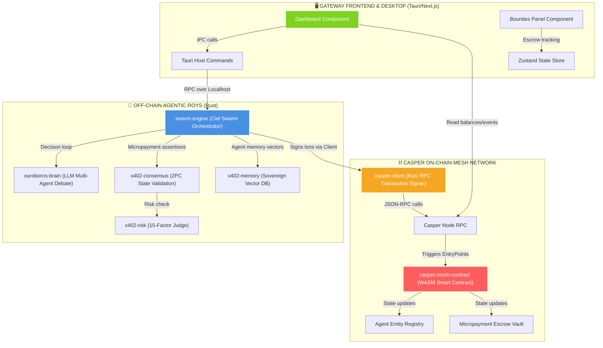

# 🌌 CASPER AGENTIC MESH — AST HYPERGRAPH & SYSTEM BLUEPRINT

> **Автоматически сгенерированный интерактивный индекс связей и структуры проекта.**

## 🗺️ 1. Архитектурный Гиперграф Связей (Mermaid)

## 📝 2. Реестр Модулей и Символов AST (Спецификация)

Всего проиндексировано **16 модулей** и **1573 ключевых символов (AST definitions)**.

### 📂 Smart Contract

| Тип | Имя символа | Путь к файлу |
| :--- | :--- | :--- |
| `function` | `call` | `contracts/casper-mesh-contract/src/lib.rs` |
| `function` | `cl_type` | `contracts/casper-mesh-contract/src/lib.rs` |
| `function` | `cl_type` | `contracts/casper-mesh-contract/src/lib.rs` |
| `function` | `create_bounty` | `contracts/casper-mesh-contract/src/lib.rs` |
| `function` | `from_bytes` | `contracts/casper-mesh-contract/src/lib.rs` |
| `function` | `from_bytes` | `contracts/casper-mesh-contract/src/lib.rs` |
| `function` | `get_dict_uref` | `contracts/casper-mesh-contract/src/lib.rs` |
| `function` | `get_escrow_purse` | `contracts/casper-mesh-contract/src/lib.rs` |
| `function` | `oom` | `contracts/casper-mesh-contract/src/lib.rs` |
| `function` | `refund_bounty` | `contracts/casper-mesh-contract/src/lib.rs` |
| `function` | `register_agent` | `contracts/casper-mesh-contract/src/lib.rs` |
| `function` | `release_bounty` | `contracts/casper-mesh-contract/src/lib.rs` |
| `function` | `serialized_length` | `contracts/casper-mesh-contract/src/lib.rs` |
| `function` | `serialized_length` | `contracts/casper-mesh-contract/src/lib.rs` |
| `function` | `to_bytes` | `contracts/casper-mesh-contract/src/lib.rs` |
| `function` | `to_bytes` | `contracts/casper-mesh-contract/src/lib.rs` |
| `impl` | `CLTyped` | `contracts/casper-mesh-contract/src/lib.rs` |
| `impl` | `CLTyped` | `contracts/casper-mesh-contract/src/lib.rs` |
| `impl` | `FromBytes` | `contracts/casper-mesh-contract/src/lib.rs` |
| `impl` | `FromBytes` | `contracts/casper-mesh-contract/src/lib.rs` |
| `impl` | `ToBytes` | `contracts/casper-mesh-contract/src/lib.rs` |
| `impl` | `ToBytes` | `contracts/casper-mesh-contract/src/lib.rs` |
| `struct` | `Agent` | `contracts/casper-mesh-contract/src/lib.rs` |
| `struct` | `Bounty` | `contracts/casper-mesh-contract/src/lib.rs` |

---

### 📂 Casper RPC Client

| Тип | Имя символа | Путь к файлу |
| :--- | :--- | :--- |
| `struct` | `RpcRequest` | `swarm/casper-client/src/main.rs` |

---

### 📂 Crate: core-ipc

| Тип | Имя символа | Путь к файлу |
| :--- | :--- | :--- |
| `function` | `default` | `swarm/core-ipc/src/lib.rs` |
| `function` | `new` | `swarm/core-ipc/src/lib.rs` |
| `function` | `read_state` | `swarm/core-ipc/src/lib.rs` |
| `function` | `write_state` | `swarm/core-ipc/src/lib.rs` |
| `impl` | `Default` | `swarm/core-ipc/src/lib.rs` |
| `impl` | `IpcBridge` | `swarm/core-ipc/src/lib.rs` |
| `struct` | `AgentState` | `swarm/core-ipc/src/lib.rs` |
| `struct` | `IpcBridge` | `swarm/core-ipc/src/lib.rs` |

---

### 📂 Crate: hive-intel

| Тип | Имя символа | Путь к файлу |
| :--- | :--- | :--- |
| `enum` | `AnomalySeverity` | `swarm/hive-intel/src/anomaly.rs` |
| `enum` | `BacktestVerdict` | `swarm/hive-intel/src/backtester.rs` |
| `enum` | `CompareOp` | `swarm/hive-intel/src/prospective.rs` |
| `enum` | `CorrelationStrength` | `swarm/hive-intel/src/correlation.rs` |
| `enum` | `DqsTier` | `swarm/hive-intel/src/dqs.rs` |
| `enum` | `GuardVerdict` | `swarm/hive-intel/src/portfolio_guard.rs` |
| `enum` | `HypothesisStatus` | `swarm/hive-intel/src/evolution.rs` |
| `enum` | `ImbalanceBias` | `swarm/hive-intel/src/orderbook_imbalance.rs` |
| `enum` | `LegitimacyTier` | `swarm/hive-intel/src/legitimacy.rs` |
| `enum` | `MarketRegime` | `swarm/hive-intel/src/markov.rs` |
| `enum` | `MarketRegime` | `swarm/hive-intel/src/regime.rs` |
| `enum` | `OrderStatus` | `swarm/hive-intel/src/paper_engine.rs` |
| `enum` | `PlanStatus` | `swarm/hive-intel/src/prospective.rs` |
| `enum` | `RiskStatus` | `swarm/hive-intel/src/risk_sizing.rs` |
| `enum` | `Side` | `swarm/hive-intel/src/paper_engine.rs` |
| `enum` | `SizingMethod` | `swarm/hive-intel/src/risk_sizing.rs` |
| `enum` | `SprtResult` | `swarm/hive-intel/src/portfolio_guard.rs` |
| `enum` | `TradingSession` | `swarm/hive-intel/src/patterns.rs` |
| `enum` | `ValidationVerdict` | `swarm/hive-intel/src/strategy_validator.rs` |
| `function` | `accuracy` | `swarm/hive-intel/src/ml_local.rs` |
| `function` | `adaptive_pain_threshold` | `swarm/hive-intel/src/tilt.rs` |
| `function` | `adaptive_streak_threshold` | `swarm/hive-intel/src/tilt.rs` |
| `function` | `adx` | `swarm/hive-intel/src/hive_indicators.rs` |
| `function` | `affective_modulation` | `swarm/hive-intel/src/recall.rs` |
| `function` | `all` | `swarm/hive-intel/src/markov.rs` |
| `function` | `analyze` | `swarm/hive-intel/src/orderbook_imbalance.rs` |
| `function` | `analyze_sessions` | `swarm/hive-intel/src/patterns.rs` |
| `function` | `apply` | `swarm/hive-intel/src/prospective.rs` |
| `function` | `as_array` | `swarm/hive-intel/src/adaptive.rs` |
| `function` | `as_array` | `swarm/hive-intel/src/ml_local.rs` |
| `function` | `as_str` | `swarm/hive-intel/src/anomaly.rs` |
| `function` | `as_str` | `swarm/hive-intel/src/backtester.rs` |
| `function` | `as_str` | `swarm/hive-intel/src/correlation.rs` |
| `function` | `as_str` | `swarm/hive-intel/src/dqs.rs` |
| `function` | `as_str` | `swarm/hive-intel/src/legitimacy.rs` |
| `function` | `as_str` | `swarm/hive-intel/src/markov.rs` |
| `function` | `as_str` | `swarm/hive-intel/src/regime.rs` |
| `function` | `as_str` | `swarm/hive-intel/src/risk_sizing.rs` |
| `function` | `as_str` | `swarm/hive-intel/src/strategy_validator.rs` |
| `function` | `atr` | `swarm/hive-intel/src/hive_indicators.rs` |
| `function` | `avg_loss` | `swarm/hive-intel/src/ml_local.rs` |
| `function` | `avg_pnl_for_symbol` | `swarm/hive-intel/src/replay.rs` |
| `function` | `batch_ema` | `swarm/hive-intel/src/turbo.rs` |
| `function` | `batch_sma` | `swarm/hive-intel/src/turbo.rs` |
| `function` | `batch_stats` | `swarm/hive-intel/src/turbo.rs` |
| `function` | `bearish_features` | `swarm/hive-intel/src/ml_local.rs` |
| `function` | `benjamini_hochberg` | `swarm/hive-intel/src/evolution.rs` |
| `function` | `beta_bernoulli_logpred` | `swarm/hive-intel/src/changepoint.rs` |
| `function` | `beta_bernoulli_update` | `swarm/hive-intel/src/changepoint.rs` |
| `function` | `bollinger_bands` | `swarm/hive-intel/src/hive_indicators.rs` |
| `function` | `boost_multiplier` | `swarm/hive-intel/src/boost.rs` |
| `function` | `build_correlation_matrix` | `swarm/hive-intel/src/correlation.rs` |
| `function` | `build_from_history` | `swarm/hive-intel/src/markov.rs` |
| `function` | `bullish_features` | `swarm/hive-intel/src/ml_local.rs` |
| `function` | `calculate_constraints` | `swarm/hive-intel/src/risk_sizing.rs` |
| `function` | `calculate_priority` | `swarm/hive-intel/src/replay.rs` |
| `function` | `calculate_rates` | `swarm/hive-intel/src/benchmark.rs` |
| `function` | `calibrate_thresholds` | `swarm/hive-intel/src/dqs.rs` |
| `function` | `calibrate_weights` | `swarm/hive-intel/src/dqs.rs` |
| `function` | `causes_of` | `swarm/hive-intel/src/causal.rs` |
| `function` | `check_auto_induction` | `swarm/hive-intel/src/induction.rs` |
| `function` | `check_consecutive_losses` | `swarm/hive-intel/src/risk_sizing.rs` |
| `function` | `check_daily_loss` | `swarm/hive-intel/src/risk_sizing.rs` |
| `function` | `classify_regime` | `swarm/hive-intel/src/regime.rs` |
| `function` | `close_order` | `swarm/hive-intel/src/paper_engine.rs` |
| `function` | `close_position` | `swarm/hive-intel/src/paper_engine.rs` |
| `function` | `combinations` | `swarm/hive-intel/src/strategy_validator.rs` |
| `function` | `combinations_recursive` | `swarm/hive-intel/src/strategy_validator.rs` |
| `function` | `compute` | `swarm/hive-intel/src/dqs.rs` |
| `function` | `compute_legitimacy` | `swarm/hive-intel/src/dqs.rs` |
| `function` | `compute_legitimacy` | `swarm/hive-intel/src/legitimacy.rs` |
| `function` | `confidence` | `swarm/hive-intel/src/semantic.rs` |
| `function` | `confidence_factor` | `swarm/hive-intel/src/recall.rs` |
| `function` | `context_hash` | `swarm/hive-intel/src/bloom.rs` |
| `function` | `context_similarity` | `swarm/hive-intel/src/recall.rs` |
| `function` | `cosine_similarity` | `swarm/hive-intel/src/hybrid_recall.rs` |
| `function` | `cosine_similarity_fast` | `swarm/hive-intel/src/turbo.rs` |
| `function` | `cpcv_sharpe` | `swarm/hive-intel/src/strategy_validator.rs` |
| `function` | `create_router_v3` | `swarm/hive-intel/src/api.rs` |
| `function` | `cusum_degradation` | `swarm/hive-intel/src/drift.rs` |
| `function` | `cusum_drift` | `swarm/hive-intel/src/drift.rs` |
| `function` | `cvar` | `swarm/hive-intel/src/turbo.rs` |
| `function` | `de_deque_f64` | `swarm/hive-intel/src/entity.rs` |
| `function` | `de_deque_i64` | `swarm/hive-intel/src/entity.rs` |
| `function` | `default` | `swarm/hive-intel/src/adaptive.rs` |
| `function` | `default` | `swarm/hive-intel/src/backtester.rs` |
| `function` | `default` | `swarm/hive-intel/src/brain.rs` |
| `function` | `default` | `swarm/hive-intel/src/causal.rs` |
| `function` | `default` | `swarm/hive-intel/src/dqs.rs` |
| `function` | `default` | `swarm/hive-intel/src/evolution.rs` |
| `function` | `default` | `swarm/hive-intel/src/hive_engine.rs` |
| `function` | `default` | `swarm/hive-intel/src/markov.rs` |
| `function` | `default` | `swarm/hive-intel/src/ml_local.rs` |
| `function` | `default` | `swarm/hive-intel/src/orderbook_imbalance.rs` |
| `function` | `default` | `swarm/hive-intel/src/portfolio_guard.rs` |
| `function` | `default` | `swarm/hive-intel/src/semantic.rs` |
| `function` | `default_config` | `swarm/hive-intel/src/benchmark.rs` |
| `function` | `default_for` | `swarm/hive-intel/src/adaptive.rs` |
| `function` | `default_input` | `swarm/hive-intel/src/dqs.rs` |
| `function` | `default_params` | `swarm/hive-intel/src/risk_sizing.rs` |
| `function` | `default_pf` | `swarm/hive-intel/src/entity.rs` |
| `function` | `default_state` | `swarm/hive-intel/src/portfolio_guard.rs` |
| `function` | `deflated_sharpe_ratio` | `swarm/hive-intel/src/evolution.rs` |
| `function` | `detect_anomaly` | `swarm/hive-intel/src/anomaly.rs` |
| `function` | `detect_disposition` | `swarm/hive-intel/src/drift.rs` |
| `function` | `detect_regime_change` | `swarm/hive-intel/src/regime.rs` |
| `function` | `discover_from_events` | `swarm/hive-intel/src/causal.rs` |
| `function` | `drawdown_scale` | `swarm/hive-intel/src/risk_sizing.rs` |
| `function` | `drawdown_state` | `swarm/hive-intel/src/legitimacy.rs` |
| `function` | `edge_key` | `swarm/hive-intel/src/causal.rs` |
| `function` | `effects_of` | `swarm/hive-intel/src/causal.rs` |
| `function` | `ema` | `swarm/hive-intel/src/hive_indicators.rs` |
| `function` | `ensure_negative_balance` | `swarm/hive-intel/src/hybrid_recall.rs` |
| `function` | `episodic_decay` | `swarm/hive-intel/src/decay.rs` |
| `function` | `erf` | `swarm/hive-intel/src/evolution.rs` |
| `function` | `estimated_fp_rate` | `swarm/hive-intel/src/bloom.rs` |
| `function` | `euclidean_distance_fast` | `swarm/hive-intel/src/turbo.rs` |
| `function` | `evaluate_alpha_boost` | `swarm/hive-intel/src/boost.rs` |
| `function` | `evaluate_portfolio_guards` | `swarm/hive-intel/src/portfolio_guard.rs` |
| `function` | `evaluate_tilt_reflex` | `swarm/hive-intel/src/tilt.rs` |
| `function` | `evaluate_trigger` | `swarm/hive-intel/src/prospective.rs` |
| `function` | `evaluate_verdict` | `swarm/hive-intel/src/backtester.rs` |
| `function` | `ewma_confidence` | `swarm/hive-intel/src/affective.rs` |
| `function` | `exposure_warning` | `swarm/hive-intel/src/correlation.rs` |
| `function` | `factor_historical_pattern` | `swarm/hive-intel/src/dqs.rs` |
| `function` | `factor_position_sizing` | `swarm/hive-intel/src/dqs.rs` |
| `function` | `factor_process_adherence` | `swarm/hive-intel/src/dqs.rs` |
| `function` | `factor_regime_match` | `swarm/hive-intel/src/dqs.rs` |
| `function` | `factor_risk_state` | `swarm/hive-intel/src/dqs.rs` |
| `function` | `find_anomalies` | `swarm/hive-intel/src/anomaly.rs` |
| `function` | `find_contiguous_blocks` | `swarm/hive-intel/src/strategy_validator.rs` |
| `function` | `fixed_risk_position_size` | `swarm/hive-intel/src/risk_sizing.rs` |
| `function` | `fnv1a` | `swarm/hive-intel/src/bloom.rs` |
| `function` | `forecast` | `swarm/hive-intel/src/markov.rs` |
| `function` | `from_r` | `swarm/hive-intel/src/correlation.rs` |
| `function` | `from_raw` | `swarm/hive-intel/src/ml_local.rs` |
| `function` | `from_timestamp_ms` | `swarm/hive-intel/src/patterns.rs` |
| `function` | `from_utc_hour` | `swarm/hive-intel/src/patterns.rs` |
| `function` | `generate_reward` | `swarm/hive-intel/src/reward.rs` |
| `function` | `generate_synthetic_candles` | `swarm/hive-intel/src/backtester.rs` |
| `function` | `get_brain` | `swarm/hive-intel/src/api.rs` |
| `function` | `get_correlations` | `swarm/hive-intel/src/api.rs` |
| `function` | `get_dna` | `swarm/hive-intel/src/api.rs` |
| `function` | `get_graph` | `swarm/hive-intel/src/api.rs` |
| `function` | `get_or_create` | `swarm/hive-intel/src/semantic.rs` |
| `function` | `get_overview` | `swarm/hive-intel/src/api.rs` |
| `function` | `get_pattern` | `swarm/hive-intel/src/api.rs` |
| `function` | `get_rankings` | `swarm/hive-intel/src/api.rs` |
| `function` | `get_reward` | `swarm/hive-intel/src/api.rs` |
| `function` | `get_sessions` | `swarm/hive-intel/src/api.rs` |
| `function` | `get_weights` | `swarm/hive-intel/src/adaptive.rs` |
| `function` | `half_kelly` | `swarm/hive-intel/src/risk_sizing.rs` |
| `function` | `hash_position` | `swarm/hive-intel/src/bloom.rs` |
| `function` | `health` | `swarm/hive-intel/src/api.rs` |
| `function` | `hybrid_blend` | `swarm/hive-intel/src/hybrid_recall.rs` |
| `function` | `hybrid_position_size` | `swarm/hive-intel/src/risk_sizing.rs` |
| `function` | `insert` | `swarm/hive-intel/src/bloom.rs` |
| `function` | `insert_trade` | `swarm/hive-intel/src/hive_engine.rs` |
| `function` | `insert_trade_simple` | `swarm/hive-intel/src/hive_engine.rs` |
| `function` | `iqr_is_anomaly` | `swarm/hive-intel/src/anomaly.rs` |
| `function` | `is_empty` | `swarm/hive-intel/src/bloom.rs` |
| `function` | `is_empty` | `swarm/hive-intel/src/replay.rs` |
| `function` | `is_mature` | `swarm/hive-intel/src/semantic.rs` |
| `function` | `is_significant` | `swarm/hive-intel/src/causal.rs` |
| `function` | `kelly_fraction` | `swarm/hive-intel/src/risk_sizing.rs` |
| `function` | `kelly_from_trades` | `swarm/hive-intel/src/dqs.rs` |
| `function` | `last_valid` | `swarm/hive-intel/src/hive_indicators.rs` |
| `function` | `len` | `swarm/hive-intel/src/bloom.rs` |
| `function` | `len` | `swarm/hive-intel/src/replay.rs` |
| `function` | `lgamma` | `swarm/hive-intel/src/changepoint.rs` |
| `function` | `load` | `swarm/hive-intel/src/ml_local.rs` |
| `function` | `load` | `swarm/hive-intel/src/paper_engine.rs` |
| `function` | `load_candles_from_csv` | `swarm/hive-intel/src/backtester.rs` |
| `function` | `load_or_new` | `swarm/hive-intel/src/brain.rs` |
| `function` | `load_snapshot` | `swarm/hive-intel/src/hive_engine.rs` |
| `function` | `load_snapshot` | `swarm/hive-intel/src/snapshot.rs` |
| `function` | `logpred` | `swarm/hive-intel/src/changepoint.rs` |
| `function` | `logpred` | `swarm/hive-intel/src/changepoint.rs` |
| `function` | `logsumexp` | `swarm/hive-intel/src/changepoint.rs` |
| `function` | `macd` | `swarm/hive-intel/src/hive_indicators.rs` |
| `function` | `make_book` | `swarm/hive-intel/src/orderbook_imbalance.rs` |
| `function` | `make_diag` | `swarm/hive-intel/src/reward.rs` |
| `function` | `make_entity` | `swarm/hive-intel/src/boost.rs` |
| `function` | `make_entity` | `swarm/hive-intel/src/reward.rs` |
| `function` | `make_entity` | `swarm/hive-intel/src/tilt.rs` |
| `function` | `make_entity_with_history` | `swarm/hive-intel/src/brain.rs` |
| `function` | `make_ep` | `swarm/hive-intel/src/induction.rs` |
| `function` | `make_exp` | `swarm/hive-intel/src/replay.rs` |
| `function` | `make_hypothesis` | `swarm/hive-intel/src/evolution.rs` |
| `function` | `make_memory` | `swarm/hive-intel/src/recall.rs` |
| `function` | `make_plan` | `swarm/hive-intel/src/prospective.rs` |
| `function` | `mature_beliefs` | `swarm/hive-intel/src/semantic.rs` |
| `function` | `max_drawdown` | `swarm/hive-intel/src/strategy_validator.rs` |
| `function` | `maybe_contains` | `swarm/hive-intel/src/bloom.rs` |
| `function` | `mean` | `swarm/hive-intel/src/anomaly.rs` |
| `function` | `median` | `swarm/hive-intel/src/anomaly.rs` |
| `function` | `memory_quality` | `swarm/hive-intel/src/legitimacy.rs` |
| `function` | `min_backtest_length` | `swarm/hive-intel/src/evolution.rs` |
| `function` | `momentum` | `swarm/hive-intel/src/orderbook_imbalance.rs` |
| `function` | `monte_carlo_extreme_probability` | `swarm/hive-intel/src/turbo.rs` |
| `function` | `monte_carlo_probability_exceeds` | `swarm/hive-intel/src/turbo.rs` |
| `function` | `most_likely_next` | `swarm/hive-intel/src/markov.rs` |
| `function` | `most_trained` | `swarm/hive-intel/src/adaptive.rs` |
| `function` | `murmur_mix` | `swarm/hive-intel/src/bloom.rs` |
| `function` | `mutate_params` | `swarm/hive-intel/src/evolution.rs` |
| `function` | `name` | `swarm/hive-intel/src/patterns.rs` |
| `function` | `new` | `swarm/hive-intel/src/adaptive.rs` |
| `function` | `new` | `swarm/hive-intel/src/backtester.rs` |
| `function` | `new` | `swarm/hive-intel/src/backtester.rs` |
| `function` | `new` | `swarm/hive-intel/src/benchmark.rs` |
| `function` | `new` | `swarm/hive-intel/src/bloom.rs` |
| `function` | `new` | `swarm/hive-intel/src/brain.rs` |
| `function` | `new` | `swarm/hive-intel/src/causal.rs` |
| `function` | `new` | `swarm/hive-intel/src/causal.rs` |
| `function` | `new` | `swarm/hive-intel/src/changepoint.rs` |
| `function` | `new` | `swarm/hive-intel/src/changepoint.rs` |
| `function` | `new` | `swarm/hive-intel/src/changepoint.rs` |
| `function` | `new` | `swarm/hive-intel/src/dqs.rs` |
| `function` | `new` | `swarm/hive-intel/src/entity.rs` |
| `function` | `new` | `swarm/hive-intel/src/hive_engine.rs` |
| `function` | `new` | `swarm/hive-intel/src/markov.rs` |
| `function` | `new` | `swarm/hive-intel/src/ml_local.rs` |
| `function` | `new` | `swarm/hive-intel/src/orderbook_imbalance.rs` |
| `function` | `new` | `swarm/hive-intel/src/orderbook_imbalance.rs` |
| `function` | `new` | `swarm/hive-intel/src/paper_engine.rs` |
| `function` | `new` | `swarm/hive-intel/src/replay.rs` |
| `function` | `new` | `swarm/hive-intel/src/risk_sizing.rs` |
| `function` | `new` | `swarm/hive-intel/src/semantic.rs` |
| `function` | `new` | `swarm/hive-intel/src/semantic.rs` |
| `function` | `nig_logpred` | `swarm/hive-intel/src/changepoint.rs` |
| `function` | `nig_update` | `swarm/hive-intel/src/changepoint.rs` |
| `function` | `norm_cdf` | `swarm/hive-intel/src/evolution.rs` |
| `function` | `normal_cdf` | `swarm/hive-intel/src/strategy_validator.rs` |
| `function` | `normalize` | `swarm/hive-intel/src/adaptive.rs` |
| `function` | `observe` | `swarm/hive-intel/src/causal.rs` |
| `function` | `observe` | `swarm/hive-intel/src/causal.rs` |
| `function` | `observe_transition` | `swarm/hive-intel/src/markov.rs` |
| `function` | `obv` | `swarm/hive-intel/src/hive_indicators.rs` |
| `function` | `on_tick` | `swarm/hive-intel/src/paper_engine.rs` |
| `function` | `open_position` | `swarm/hive-intel/src/paper_engine.rs` |
| `function` | `optimal` | `swarm/hive-intel/src/bloom.rs` |
| `function` | `outcome_quality` | `swarm/hive-intel/src/recall.rs` |
| `function` | `outcome_weighted_recall` | `swarm/hive-intel/src/recall.rs` |
| `function` | `parse` | `swarm/hive-intel/src/markov.rs` |
| `function` | `parse` | `swarm/hive-intel/src/prospective.rs` |
| `function` | `pearson_correlation` | `swarm/hive-intel/src/correlation.rs` |
| `function` | `percentile_rank` | `swarm/hive-intel/src/anomaly.rs` |
| `function` | `pnl_to_returns` | `swarm/hive-intel/src/brain.rs` |
| `function` | `posterior_mean` | `swarm/hive-intel/src/changepoint.rs` |
| `function` | `predict` | `swarm/hive-intel/src/causal.rs` |
| `function` | `predict` | `swarm/hive-intel/src/ml_local.rs` |
| `function` | `predict_next` | `swarm/hive-intel/src/markov.rs` |
| `function` | `print_report` | `swarm/hive-intel/src/backtester.rs` |
| `function` | `print_report` | `swarm/hive-intel/src/paper_engine.rs` |
| `function` | `priority` | `swarm/hive-intel/src/risk_sizing.rs` |
| `function` | `process_candle` | `swarm/hive-intel/src/backtester.rs` |
| `function` | `process_trade` | `swarm/hive-intel/src/brain.rs` |
| `function` | `push` | `swarm/hive-intel/src/replay.rs` |
| `function` | `push_hold_ms` | `swarm/hive-intel/src/entity.rs` |
| `function` | `push_pnl` | `swarm/hive-intel/src/entity.rs` |
| `function` | `query_confidence` | `swarm/hive-intel/src/semantic.rs` |
| `function` | `rank_by_is_fitness` | `swarm/hive-intel/src/evolution.rs` |
| `function` | `raw_sharpe` | `swarm/hive-intel/src/strategy_validator.rs` |
| `function` | `recalculate_derived` | `swarm/hive-intel/src/entity.rs` |
| `function` | `recall_by_context` | `swarm/hive-intel/src/replay.rs` |
| `function` | `recall_by_symbol` | `swarm/hive-intel/src/replay.rs` |
| `function` | `recent_hold_ms_vec` | `swarm/hive-intel/src/entity.rs` |
| `function` | `recent_pnl_slice` | `swarm/hive-intel/src/entity.rs` |
| `function` | `record_outcome` | `swarm/hive-intel/src/prospective.rs` |
| `function` | `record_outcome` | `swarm/hive-intel/src/semantic.rs` |
| `function` | `regime_confidence` | `swarm/hive-intel/src/legitimacy.rs` |
| `function` | `regime_match_factor` | `swarm/hive-intel/src/decay.rs` |
| `function` | `regime_stability` | `swarm/hive-intel/src/markov.rs` |
| `function` | `reset` | `swarm/hive-intel/src/backtester.rs` |
| `function` | `reset_daily` | `swarm/hive-intel/src/paper_engine.rs` |
| `function` | `reward_to_json` | `swarm/hive-intel/src/reward.rs` |
| `function` | `risk_appetite` | `swarm/hive-intel/src/affective.rs` |
| `function` | `round6` | `swarm/hive-intel/src/evolution.rs` |
| `function` | `rsi` | `swarm/hive-intel/src/hive_indicators.rs` |
| `function` | `run` | `swarm/hive-intel/src/backtester.rs` |
| `function` | `sample_prices` | `swarm/hive-intel/src/hive_indicators.rs` |
| `function` | `sample_std` | `swarm/hive-intel/src/strategy_validator.rs` |
| `function` | `sample_sufficiency` | `swarm/hive-intel/src/legitimacy.rs` |
| `function` | `save` | `swarm/hive-intel/src/ml_local.rs` |
| `function` | `save` | `swarm/hive-intel/src/paper_engine.rs` |
| `function` | `save_brain` | `swarm/hive-intel/src/brain.rs` |
| `function` | `save_snapshot` | `swarm/hive-intel/src/hive_engine.rs` |
| `function` | `save_snapshot` | `swarm/hive-intel/src/snapshot.rs` |
| `function` | `seed` | `swarm/hive-intel/src/benchmark.rs` |
| `function` | `seed_synthetic` | `swarm/hive-intel/src/benchmark.rs` |
| `function` | `select_and_eliminate` | `swarm/hive-intel/src/evolution.rs` |
| `function` | `semantic_decay` | `swarm/hive-intel/src/decay.rs` |
| `function` | `ser_deque_f64` | `swarm/hive-intel/src/entity.rs` |
| `function` | `ser_deque_i64` | `swarm/hive-intel/src/entity.rs` |
| `function` | `session_multiplier` | `swarm/hive-intel/src/risk_sizing.rs` |
| `function` | `should_boost` | `swarm/hive-intel/src/boost.rs` |
| `function` | `should_tilt_lock` | `swarm/hive-intel/src/tilt.rs` |
| `function` | `sigmoid` | `swarm/hive-intel/src/dqs.rs` |
| `function` | `sigmoid` | `swarm/hive-intel/src/ml_local.rs` |
| `function` | `sigmoid` | `swarm/hive-intel/src/recall.rs` |
| `function` | `sigmoid_size` | `swarm/hive-intel/src/reward.rs` |
| `function` | `signal` | `swarm/hive-intel/src/benchmark.rs` |
| `function` | `significant_edges` | `swarm/hive-intel/src/causal.rs` |
| `function` | `sma` | `swarm/hive-intel/src/benchmark.rs` |
| `function` | `snapshot_hashmap` | `swarm/hive-intel/src/hive_engine.rs` |
| `function` | `sprt_evaluate` | `swarm/hive-intel/src/portfolio_guard.rs` |
| `function` | `stats` | `swarm/hive-intel/src/paper_engine.rs` |
| `function` | `std_dev` | `swarm/hive-intel/src/anomaly.rs` |
| `function` | `stochastic_rsi` | `swarm/hive-intel/src/hive_indicators.rs` |
| `function` | `streak_state` | `swarm/hive-intel/src/legitimacy.rs` |
| `function` | `strength` | `swarm/hive-intel/src/causal.rs` |
| `function` | `test_accuracy_perfect` | `swarm/hive-intel/src/ml_local.rs` |
| `function` | `test_adaptive_consecutive_stopped` | `swarm/hive-intel/src/risk_sizing.rs` |
| `function` | `test_adaptive_daily_loss_reduced` | `swarm/hive-intel/src/risk_sizing.rs` |
| `function` | `test_adaptive_daily_loss_stopped` | `swarm/hive-intel/src/risk_sizing.rs` |
| `function` | `test_adaptive_drawdown_scaling` | `swarm/hive-intel/src/risk_sizing.rs` |
| `function` | `test_adaptive_healthy` | `swarm/hive-intel/src/risk_sizing.rs` |
| `function` | `test_adaptive_insufficient_data` | `swarm/hive-intel/src/risk_sizing.rs` |
| `function` | `test_adaptive_pain_scales_with_avg_loss` | `swarm/hive-intel/src/tilt.rs` |
| `function` | `test_adaptive_session_weak` | `swarm/hive-intel/src/risk_sizing.rs` |
| `function` | `test_adaptive_streak_default_for_new` | `swarm/hive-intel/src/tilt.rs` |
| `function` | `test_adaptive_streak_scales_with_rr` | `swarm/hive-intel/src/tilt.rs` |
| `function` | `test_adx_range` | `swarm/hive-intel/src/hive_indicators.rs` |
| `function` | `test_affective_during_drawdown` | `swarm/hive-intel/src/recall.rs` |
| `function` | `test_all_operators` | `swarm/hive-intel/src/prospective.rs` |
| `function` | `test_analyze_empty_trades` | `swarm/hive-intel/src/patterns.rs` |
| `function` | `test_analyze_sessions_basic` | `swarm/hive-intel/src/patterns.rs` |
| `function` | `test_approved_normal` | `swarm/hive-intel/src/portfolio_guard.rs` |
| `function` | `test_at_threshold` | `swarm/hive-intel/src/induction.rs` |
| `function` | `test_atr_positive` | `swarm/hive-intel/src/hive_indicators.rs` |
| `function` | `test_avg_loss_decreases_with_training` | `swarm/hive-intel/src/ml_local.rs` |
| `function` | `test_avg_pnl` | `swarm/hive-intel/src/replay.rs` |
| `function` | `test_avg_sizes_from_entity` | `swarm/hive-intel/src/entity.rs` |
| `function` | `test_backtest_empty_candles` | `swarm/hive-intel/src/backtester.rs` |
| `function` | `test_backtest_equity_curve_monotonic_start` | `swarm/hive-intel/src/backtester.rs` |
| `function` | `test_backtest_generates_signals` | `swarm/hive-intel/src/backtester.rs` |
| `function` | `test_backtest_runs_to_completion` | `swarm/hive-intel/src/backtester.rs` |
| `function` | `test_backtest_verdict_not_ready` | `swarm/hive-intel/src/backtester.rs` |
| `function` | `test_backtest_verdict_promising` | `swarm/hive-intel/src/backtester.rs` |
| `function` | `test_backtest_verdict_ready` | `swarm/hive-intel/src/backtester.rs` |
| `function` | `test_basic_sizing` | `swarm/hive-intel/src/risk_sizing.rs` |
| `function` | `test_batch_ema_converges` | `swarm/hive-intel/src/turbo.rs` |
| `function` | `test_batch_ema_starts_from_first` | `swarm/hive-intel/src/turbo.rs` |
| `function` | `test_batch_rounding` | `swarm/hive-intel/src/risk_sizing.rs` |
| `function` | `test_batch_sma_basic` | `swarm/hive-intel/src/turbo.rs` |
| `function` | `test_batch_stats_basic` | `swarm/hive-intel/src/turbo.rs` |
| `function` | `test_batch_stats_empty` | `swarm/hive-intel/src/turbo.rs` |
| `function` | `test_batch_stats_single` | `swarm/hive-intel/src/turbo.rs` |
| `function` | `test_batch_train` | `swarm/hive-intel/src/ml_local.rs` |
| `function` | `test_bearish_imbalance` | `swarm/hive-intel/src/orderbook_imbalance.rs` |
| `function` | `test_below_threshold` | `swarm/hive-intel/src/induction.rs` |
| `function` | `test_benchmark_stats` | `swarm/hive-intel/src/benchmark.rs` |
| `function` | `test_bh_empty` | `swarm/hive-intel/src/evolution.rs` |
| `function` | `test_bh_no_significant` | `swarm/hive-intel/src/evolution.rs` |
| `function` | `test_bh_some_significant` | `swarm/hive-intel/src/evolution.rs` |
| `function` | `test_binary_smaller_than_json` | `swarm/hive-intel/src/snapshot.rs` |
| `function` | `test_bollinger_bands_order` | `swarm/hive-intel/src/hive_indicators.rs` |
| `function` | `test_boost_hot_streak` | `swarm/hive-intel/src/boost.rs` |
| `function` | `test_boost_pf_monster` | `swarm/hive-intel/src/boost.rs` |
| `function` | `test_boost_proven_alpha` | `swarm/hive-intel/src/boost.rs` |
| `function` | `test_brain_adaptive_updates` | `swarm/hive-intel/src/brain.rs` |
| `function` | `test_brain_cross_symbol_causal` | `swarm/hive-intel/src/brain.rs` |
| `function` | `test_brain_detects_drift` | `swarm/hive-intel/src/brain.rs` |
| `function` | `test_brain_drawdown_tracking` | `swarm/hive-intel/src/brain.rs` |
| `function` | `test_brain_novelty_detection` | `swarm/hive-intel/src/brain.rs` |
| `function` | `test_brain_obi_integration` | `swarm/hive-intel/src/brain.rs` |
| `function` | `test_brain_obi_neutral_without_data` | `swarm/hive-intel/src/brain.rs` |
| `function` | `test_brain_persistence_roundtrip` | `swarm/hive-intel/src/brain.rs` |
| `function` | `test_brain_processes_trade` | `swarm/hive-intel/src/brain.rs` |
| `function` | `test_build_from_history` | `swarm/hive-intel/src/markov.rs` |
| `function` | `test_bullish_imbalance` | `swarm/hive-intel/src/orderbook_imbalance.rs` |
| `function` | `test_calibrate_thresholds` | `swarm/hive-intel/src/dqs.rs` |
| `function` | `test_capacity_evicts_lowest` | `swarm/hive-intel/src/replay.rs` |
| `function` | `test_circuit_breaker_drawdown` | `swarm/hive-intel/src/paper_engine.rs` |
| `function` | `test_combinations_c4_1` | `swarm/hive-intel/src/strategy_validator.rs` |
| `function` | `test_combinations_c5_2` | `swarm/hive-intel/src/strategy_validator.rs` |
| `function` | `test_combinations_c6_3` | `swarm/hive-intel/src/strategy_validator.rs` |
| `function` | `test_compare_op_from_str` | `swarm/hive-intel/src/prospective.rs` |
| `function` | `test_confidence_at_threshold` | `swarm/hive-intel/src/ml_local.rs` |
| `function` | `test_config_default` | `swarm/hive-intel/src/backtester.rs` |
| `function` | `test_constant_series` | `swarm/hive-intel/src/correlation.rs` |
| `function` | `test_context_hash_deterministic` | `swarm/hive-intel/src/bloom.rs` |
| `function` | `test_context_hash_differs` | `swarm/hive-intel/src/bloom.rs` |
| `function` | `test_context_similarity_different_regime` | `swarm/hive-intel/src/recall.rs` |
| `function` | `test_context_similarity_identical` | `swarm/hive-intel/src/recall.rs` |
| `function` | `test_contiguous_blocks` | `swarm/hive-intel/src/strategy_validator.rs` |
| `function` | `test_contiguous_blocks_single` | `swarm/hive-intel/src/strategy_validator.rs` |
| `function` | `test_correlation_matrix_finds_pairs` | `swarm/hive-intel/src/correlation.rs` |
| `function` | `test_cosine_empty` | `swarm/hive-intel/src/hybrid_recall.rs` |
| `function` | `test_cosine_fast_empty` | `swarm/hive-intel/src/turbo.rs` |
| `function` | `test_cosine_fast_identical` | `swarm/hive-intel/src/turbo.rs` |
| `function` | `test_cosine_fast_matches_naive` | `swarm/hive-intel/src/turbo.rs` |
| `function` | `test_cosine_fast_odd_length` | `swarm/hive-intel/src/turbo.rs` |
| `function` | `test_cosine_fast_opposite` | `swarm/hive-intel/src/turbo.rs` |
| `function` | `test_cosine_fast_orthogonal` | `swarm/hive-intel/src/turbo.rs` |
| `function` | `test_cosine_identical` | `swarm/hive-intel/src/hybrid_recall.rs` |
| `function` | `test_cosine_length_mismatch` | `swarm/hive-intel/src/hybrid_recall.rs` |
| `function` | `test_cosine_opposite` | `swarm/hive-intel/src/hybrid_recall.rs` |
| `function` | `test_cosine_orthogonal` | `swarm/hive-intel/src/hybrid_recall.rs` |
| `function` | `test_cpcv_consistent_positive` | `swarm/hive-intel/src/strategy_validator.rs` |
| `function` | `test_cpcv_insufficient_data` | `swarm/hive-intel/src/strategy_validator.rs` |
| `function` | `test_cpcv_negative_returns` | `swarm/hive-intel/src/strategy_validator.rs` |
| `function` | `test_csv_loading_invalid_path` | `swarm/hive-intel/src/backtester.rs` |
| `function` | `test_cusum_alert` | `swarm/hive-intel/src/changepoint.rs` |
| `function` | `test_cusum_degradation` | `swarm/hive-intel/src/drift.rs` |
| `function` | `test_cusum_detects_improvement` | `swarm/hive-intel/src/drift.rs` |
| `function` | `test_cusum_no_drift` | `swarm/hive-intel/src/drift.rs` |
| `function` | `test_cvar_worst_5pct` | `swarm/hive-intel/src/turbo.rs` |
| `function` | `test_cvd_tracker` | `swarm/hive-intel/src/orderbook_imbalance.rs` |
| `function` | `test_cvd_trend` | `swarm/hive-intel/src/orderbook_imbalance.rs` |
| `function` | `test_daily_loss_limit` | `swarm/hive-intel/src/paper_engine.rs` |
| `function` | `test_default_weights_sum_to_one` | `swarm/hive-intel/src/adaptive.rs` |
| `function` | `test_denied_daily_loss` | `swarm/hive-intel/src/portfolio_guard.rs` |
| `function` | `test_denied_drawdown` | `swarm/hive-intel/src/portfolio_guard.rs` |
| `function` | `test_denied_max_notional` | `swarm/hive-intel/src/portfolio_guard.rs` |
| `function` | `test_denied_max_positions` | `swarm/hive-intel/src/portfolio_guard.rs` |
| `function` | `test_denied_order_rate` | `swarm/hive-intel/src/portfolio_guard.rs` |
| `function` | `test_disposition_normal` | `swarm/hive-intel/src/drift.rs` |
| `function` | `test_disposition_severe` | `swarm/hive-intel/src/drift.rs` |
| `function` | `test_dqs_go_tier` | `swarm/hive-intel/src/dqs.rs` |
| `function` | `test_dqs_skip_in_danger` | `swarm/hive-intel/src/dqs.rs` |
| `function` | `test_drawdown_thresholds` | `swarm/hive-intel/src/legitimacy.rs` |
| `function` | `test_dsr_insufficient_data` | `swarm/hive-intel/src/evolution.rs` |
| `function` | `test_dsr_many_trials_deflates` | `swarm/hive-intel/src/evolution.rs` |
| `function` | `test_dsr_single_trial` | `swarm/hive-intel/src/evolution.rs` |
| `function` | `test_duplicate_position_rejected` | `swarm/hive-intel/src/paper_engine.rs` |
| `function` | `test_edge_confirms_increase_strength` | `swarm/hive-intel/src/causal.rs` |
| `function` | `test_edge_strength_starts_neutral` | `swarm/hive-intel/src/causal.rs` |
| `function` | `test_ema_converges` | `swarm/hive-intel/src/hive_indicators.rs` |
| `function` | `test_empty_book` | `swarm/hive-intel/src/orderbook_imbalance.rs` |
| `function` | `test_empty_buffer` | `swarm/hive-intel/src/replay.rs` |
| `function` | `test_empty_input` | `swarm/hive-intel/src/hive_indicators.rs` |
| `function` | `test_empty_logsumexp` | `swarm/hive-intel/src/changepoint.rs` |
| `function` | `test_empty_matrix_uniform` | `swarm/hive-intel/src/markov.rs` |
| `function` | `test_empty_returns_ranging` | `swarm/hive-intel/src/regime.rs` |
| `function` | `test_episodic_decay_at_zero` | `swarm/hive-intel/src/decay.rs` |
| `function` | `test_episodic_decay_decreases_over_time` | `swarm/hive-intel/src/decay.rs` |
| `function` | `test_erf_bounds` | `swarm/hive-intel/src/evolution.rs` |
| `function` | `test_euclidean_known` | `swarm/hive-intel/src/turbo.rs` |
| `function` | `test_euclidean_same` | `swarm/hive-intel/src/turbo.rs` |
| `function` | `test_ewma_all_losses_low_confidence` | `swarm/hive-intel/src/affective.rs` |
| `function` | `test_ewma_all_wins_high_confidence` | `swarm/hive-intel/src/affective.rs` |
| `function` | `test_ewma_empty_returns_neutral` | `swarm/hive-intel/src/affective.rs` |
| `function` | `test_exposure_warning` | `swarm/hive-intel/src/correlation.rs` |
| `function` | `test_extreme_loss` | `swarm/hive-intel/src/anomaly.rs` |
| `function` | `test_extreme_probability` | `swarm/hive-intel/src/turbo.rs` |
| `function` | `test_extreme_win` | `swarm/hive-intel/src/anomaly.rs` |
| `function` | `test_factor_historical_negative` | `swarm/hive-intel/src/dqs.rs` |
| `function` | `test_factor_historical_positive` | `swarm/hive-intel/src/dqs.rs` |
| `function` | `test_factor_position_sizing_exact_kelly` | `swarm/hive-intel/src/dqs.rs` |
| `function` | `test_factor_position_sizing_far_from_kelly` | `swarm/hive-intel/src/dqs.rs` |
| `function` | `test_factor_regime_match_equal` | `swarm/hive-intel/src/dqs.rs` |
| `function` | `test_factor_regime_match_half` | `swarm/hive-intel/src/dqs.rs` |
| `function` | `test_factor_risk_hard_stop_drawdown` | `swarm/hive-intel/src/dqs.rs` |
| `function` | `test_factor_risk_hard_stop_losses` | `swarm/hive-intel/src/dqs.rs` |
| `function` | `test_feature_as_array` | `swarm/hive-intel/src/ml_local.rs` |
| `function` | `test_feature_clamping` | `swarm/hive-intel/src/ml_local.rs` |
| `function` | `test_feature_normalization` | `swarm/hive-intel/src/ml_local.rs` |
| `function` | `test_find_anomalies_batch` | `swarm/hive-intel/src/anomaly.rs` |
| `function` | `test_forecast_high_vol_risk` | `swarm/hive-intel/src/markov.rs` |
| `function` | `test_forecast_recommendation` | `swarm/hive-intel/src/markov.rs` |
| `function` | `test_fp_rate_low_with_few_items` | `swarm/hive-intel/src/bloom.rs` |
| `function` | `test_full_legitimacy` | `swarm/hive-intel/src/legitimacy.rs` |
| `function` | `test_full_validation` | `swarm/hive-intel/src/strategy_validator.rs` |
| `function` | `test_graph_discover_from_events` | `swarm/hive-intel/src/causal.rs` |
| `function` | `test_graph_observe_and_query` | `swarm/hive-intel/src/causal.rs` |
| `function` | `test_guard_priority_drawdown_first` | `swarm/hive-intel/src/portfolio_guard.rs` |
| `function` | `test_half_kelly` | `swarm/hive-intel/src/risk_sizing.rs` |
| `function` | `test_hard_limit` | `swarm/hive-intel/src/risk_sizing.rs` |
| `function` | `test_hybrid_blend_limit` | `swarm/hive-intel/src/hybrid_recall.rs` |
| `function` | `test_hybrid_blend_pure_owm` | `swarm/hive-intel/src/hybrid_recall.rs` |
| `function` | `test_hybrid_blend_with_vectors` | `swarm/hive-intel/src/hybrid_recall.rs` |
| `function` | `test_hybrid_falls_back_to_fixed` | `swarm/hive-intel/src/risk_sizing.rs` |
| `function` | `test_hybrid_result_fields` | `swarm/hive-intel/src/risk_sizing.rs` |
| `function` | `test_hybrid_uses_minimum` | `swarm/hive-intel/src/risk_sizing.rs` |
| `function` | `test_imbalance_history_tracking` | `swarm/hive-intel/src/orderbook_imbalance.rs` |
| `function` | `test_initial_model_bullish_bias` | `swarm/hive-intel/src/ml_local.rs` |
| `function` | `test_initial_state` | `swarm/hive-intel/src/changepoint.rs` |
| `function` | `test_insert_and_contains` | `swarm/hive-intel/src/bloom.rs` |
| `function` | `test_insert_trade_updates_counts` | `swarm/hive-intel/src/hive_engine.rs` |
| `function` | `test_insufficient_data` | `swarm/hive-intel/src/correlation.rs` |
| `function` | `test_insufficient_history` | `swarm/hive-intel/src/anomaly.rs` |
| `function` | `test_iqr_flags_outlier` | `swarm/hive-intel/src/anomaly.rs` |
| `function` | `test_kelly_breakeven` | `swarm/hive-intel/src/risk_sizing.rs` |
| `function` | `test_kelly_edge_cases` | `swarm/hive-intel/src/risk_sizing.rs` |
| `function` | `test_kelly_insufficient_data` | `swarm/hive-intel/src/dqs.rs` |
| `function` | `test_kelly_losing` | `swarm/hive-intel/src/risk_sizing.rs` |
| `function` | `test_kelly_losing_strategy` | `swarm/hive-intel/src/dqs.rs` |
| `function` | `test_kelly_profitable` | `swarm/hive-intel/src/risk_sizing.rs` |
| `function` | `test_kelly_profitable_strategy` | `swarm/hive-intel/src/dqs.rs` |
| `function` | `test_last_valid_fn` | `swarm/hive-intel/src/hive_indicators.rs` |
| `function` | `test_legitimacy_full` | `swarm/hive-intel/src/dqs.rs` |
| `function` | `test_legitimacy_reduced` | `swarm/hive-intel/src/dqs.rs` |
| `function` | `test_legitimacy_skip_new_strategy` | `swarm/hive-intel/src/dqs.rs` |
| `function` | `test_load_empty_returns_empty` | `swarm/hive-intel/src/snapshot.rs` |
| `function` | `test_logsumexp_basic` | `swarm/hive-intel/src/changepoint.rs` |
| `function` | `test_low_priority_rejected` | `swarm/hive-intel/src/replay.rs` |
| `function` | `test_macd_structure` | `swarm/hive-intel/src/hive_indicators.rs` |
| `function` | `test_max_drawdown` | `swarm/hive-intel/src/strategy_validator.rs` |
| `function` | `test_max_drawdown_empty` | `swarm/hive-intel/src/strategy_validator.rs` |
| `function` | `test_max_drawdown_tracking` | `swarm/hive-intel/src/paper_engine.rs` |
| `function` | `test_memory_quality_clamp` | `swarm/hive-intel/src/legitimacy.rs` |
| `function` | `test_min_backtest_length` | `swarm/hive-intel/src/evolution.rs` |
| `function` | `test_min_weight_floor` | `swarm/hive-intel/src/adaptive.rs` |
| `function` | `test_monte_carlo_all_above` | `swarm/hive-intel/src/turbo.rs` |
| `function` | `test_monte_carlo_half` | `swarm/hive-intel/src/turbo.rs` |
| `function` | `test_monte_carlo_none_above` | `swarm/hive-intel/src/turbo.rs` |
| `function` | `test_most_likely_next` | `swarm/hive-intel/src/markov.rs` |
| `function` | `test_multiple_patterns` | `swarm/hive-intel/src/induction.rs` |
| `function` | `test_multiplier_tiers` | `swarm/hive-intel/src/boost.rs` |
| `function` | `test_mutate_params_changes_values` | `swarm/hive-intel/src/evolution.rs` |
| `function` | `test_mutate_params_deterministic` | `swarm/hive-intel/src/evolution.rs` |
| `function` | `test_mutate_zero_scale` | `swarm/hive-intel/src/evolution.rs` |
| `function` | `test_negative_balance_already_met` | `swarm/hive-intel/src/hybrid_recall.rs` |
| `function` | `test_negative_balance_swap` | `swarm/hive-intel/src/hybrid_recall.rs` |
| `function` | `test_negative_outcome_shifts_away` | `swarm/hive-intel/src/adaptive.rs` |
| `function` | `test_neutral_balanced_book` | `swarm/hive-intel/src/orderbook_imbalance.rs` |
| `function` | `test_new_entity` | `swarm/hive-intel/src/entity.rs` |
| `function` | `test_nig_update_precision` | `swarm/hive-intel/src/changepoint.rs` |
| `function` | `test_no_boost_mediocre` | `swarm/hive-intel/src/boost.rs` |
| `function` | `test_no_correlation` | `swarm/hive-intel/src/correlation.rs` |
| `function` | `test_no_pnl_data` | `swarm/hive-intel/src/induction.rs` |
| `function` | `test_no_tilt_healthy` | `swarm/hive-intel/src/tilt.rs` |
| `function` | `test_no_tilt_low_pf_few_trades` | `swarm/hive-intel/src/tilt.rs` |
| `function` | `test_norm_cdf_symmetry` | `swarm/hive-intel/src/evolution.rs` |
| `function` | `test_norm_cdf_zero` | `swarm/hive-intel/src/evolution.rs` |
| `function` | `test_normal_cdf_symmetry` | `swarm/hive-intel/src/strategy_validator.rs` |
| `function` | `test_normal_cdf_zero` | `swarm/hive-intel/src/strategy_validator.rs` |
| `function` | `test_normal_trade` | `swarm/hive-intel/src/anomaly.rs` |
| `function` | `test_not_contains` | `swarm/hive-intel/src/bloom.rs` |
| `function` | `test_obv_direction` | `swarm/hive-intel/src/hive_indicators.rs` |
| `function` | `test_open_and_close_loss` | `swarm/hive-intel/src/paper_engine.rs` |
| `function` | `test_open_and_close_profitable` | `swarm/hive-intel/src/paper_engine.rs` |
| `function` | `test_optimal_creation` | `swarm/hive-intel/src/bloom.rs` |
| `function` | `test_outcome_quality_negative` | `swarm/hive-intel/src/recall.rs` |
| `function` | `test_outcome_quality_positive` | `swarm/hive-intel/src/recall.rs` |
| `function` | `test_oversized_position_rejected` | `swarm/hive-intel/src/paper_engine.rs` |
| `function` | `test_percentile_calculation` | `swarm/hive-intel/src/anomaly.rs` |
| `function` | `test_perfect_negative_correlation` | `swarm/hive-intel/src/correlation.rs` |
| `function` | `test_perfect_positive_correlation` | `swarm/hive-intel/src/correlation.rs` |
| `function` | `test_perfect_score` | `swarm/hive-intel/src/legitimacy.rs` |
| `function` | `test_persist_survives_snapshot` | `swarm/hive-intel/src/hive_engine.rs` |
| `function` | `test_persistence_roundtrip` | `swarm/hive-intel/src/ml_local.rs` |
| `function` | `test_persistence_roundtrip` | `swarm/hive-intel/src/paper_engine.rs` |
| `function` | `test_pnl_to_returns` | `swarm/hive-intel/src/brain.rs` |
| `function` | `test_positive_outcome_shifts_weights` | `swarm/hive-intel/src/adaptive.rs` |
| `function` | `test_predict_returns_significant_only` | `swarm/hive-intel/src/causal.rs` |
| `function` | `test_prediction_fields` | `swarm/hive-intel/src/ml_local.rs` |
| `function` | `test_priority_calculation` | `swarm/hive-intel/src/replay.rs` |
| `function` | `test_probabilities_sum_to_one` | `swarm/hive-intel/src/markov.rs` |
| `function` | `test_push_and_len` | `swarm/hive-intel/src/replay.rs` |
| `function` | `test_push_pnl_ring_buffer` | `swarm/hive-intel/src/entity.rs` |
| `function` | `test_ranging` | `swarm/hive-intel/src/regime.rs` |
| `function` | `test_rank_filters_low_sharpe` | `swarm/hive-intel/src/evolution.rs` |
| `function` | `test_rank_filters_low_trade_count` | `swarm/hive-intel/src/evolution.rs` |
| `function` | `test_raw_sharpe_insufficient` | `swarm/hive-intel/src/strategy_validator.rs` |
| `function` | `test_raw_sharpe_negative` | `swarm/hive-intel/src/strategy_validator.rs` |
| `function` | `test_raw_sharpe_positive` | `swarm/hive-intel/src/strategy_validator.rs` |
| `function` | `test_recall_by_context` | `swarm/hive-intel/src/replay.rs` |
| `function` | `test_recall_by_symbol` | `swarm/hive-intel/src/replay.rs` |
| `function` | `test_recall_ranks_by_score` | `swarm/hive-intel/src/recall.rs` |
| `function` | `test_recent_pnl_populated` | `swarm/hive-intel/src/hive_engine.rs` |
| `function` | `test_record_outcome_loss` | `swarm/hive-intel/src/prospective.rs` |
| `function` | `test_record_outcome_profit` | `swarm/hive-intel/src/prospective.rs` |
| `function` | `test_reduced_legitimacy` | `swarm/hive-intel/src/legitimacy.rs` |
| `function` | `test_regime_change_detection` | `swarm/hive-intel/src/changepoint.rs` |
| `function` | `test_regime_change_detection` | `swarm/hive-intel/src/regime.rs` |
| `function` | `test_regime_match` | `swarm/hive-intel/src/decay.rs` |
| `function` | `test_rehearsal_boosts_strength` | `swarm/hive-intel/src/decay.rs` |
| `function` | `test_reset_daily` | `swarm/hive-intel/src/paper_engine.rs` |
| `function` | `test_reward_json_serializable` | `swarm/hive-intel/src/reward.rs` |
| `function` | `test_reward_loss_volatile_offhours` | `swarm/hive-intel/src/reward.rs` |
| `function` | `test_reward_novel_context_neutral` | `swarm/hive-intel/src/reward.rs` |
| `function` | `test_reward_profitable_trending` | `swarm/hive-intel/src/reward.rs` |
| `function` | `test_reward_weights_sum_to_one` | `swarm/hive-intel/src/reward.rs` |
| `function` | `test_risk_appetite_half_drawdown` | `swarm/hive-intel/src/affective.rs` |
| `function` | `test_risk_appetite_max_drawdown` | `swarm/hive-intel/src/affective.rs` |
| `function` | `test_risk_appetite_no_drawdown` | `swarm/hive-intel/src/affective.rs` |
| `function` | `test_rsi_all_down` | `swarm/hive-intel/src/backtester.rs` |
| `function` | `test_rsi_all_up` | `swarm/hive-intel/src/backtester.rs` |
| `function` | `test_rsi_constant_price` | `swarm/hive-intel/src/hive_indicators.rs` |
| `function` | `test_rsi_initial_period` | `swarm/hive-intel/src/backtester.rs` |
| `function` | `test_rsi_range` | `swarm/hive-intel/src/hive_indicators.rs` |
| `function` | `test_rsi_reset` | `swarm/hive-intel/src/backtester.rs` |
| `function` | `test_rsi_warmup` | `swarm/hive-intel/src/hive_indicators.rs` |
| `function` | `test_sample_std_basic` | `swarm/hive-intel/src/strategy_validator.rs` |
| `function` | `test_sample_sufficiency_thresholds` | `swarm/hive-intel/src/legitimacy.rs` |
| `function` | `test_seed_synthetic` | `swarm/hive-intel/src/benchmark.rs` |
| `function` | `test_semantic_decays_slower` | `swarm/hive-intel/src/decay.rs` |
| `function` | `test_semantic_store_record` | `swarm/hive-intel/src/semantic.rs` |
| `function` | `test_session_from_timestamp` | `swarm/hive-intel/src/patterns.rs` |
| `function` | `test_session_from_utc_hour` | `swarm/hive-intel/src/patterns.rs` |
| `function` | `test_session_names_unique` | `swarm/hive-intel/src/patterns.rs` |
| `function` | `test_session_zero_timestamp` | `swarm/hive-intel/src/patterns.rs` |
| `function` | `test_short_position` | `swarm/hive-intel/src/paper_engine.rs` |
| `function` | `test_sigmoid_bounds` | `swarm/hive-intel/src/ml_local.rs` |
| `function` | `test_sigmoid_size_range` | `swarm/hive-intel/src/reward.rs` |
| `function` | `test_sigmoid_symmetry` | `swarm/hive-intel/src/dqs.rs` |
| `function` | `test_sigmoid_symmetry` | `swarm/hive-intel/src/recall.rs` |
| `function` | `test_sigmoid_zero` | `swarm/hive-intel/src/dqs.rs` |
| `function` | `test_single_dominant_transition` | `swarm/hive-intel/src/markov.rs` |
| `function` | `test_single_observation` | `swarm/hive-intel/src/changepoint.rs` |
| `function` | `test_skip_legitimacy` | `swarm/hive-intel/src/legitimacy.rs` |
| `function` | `test_sma_crossover_bearish` | `swarm/hive-intel/src/benchmark.rs` |
| `function` | `test_sma_crossover_bullish` | `swarm/hive-intel/src/benchmark.rs` |
| `function` | `test_sma_insufficient_data` | `swarm/hive-intel/src/benchmark.rs` |
| `function` | `test_snapshot_hashmap_export` | `swarm/hive-intel/src/hive_engine.rs` |
| `function` | `test_snapshot_roundtrip_json` | `swarm/hive-intel/src/snapshot.rs` |
| `function` | `test_spread_calculation` | `swarm/hive-intel/src/orderbook_imbalance.rs` |
| `function` | `test_sprt_boundary_50_50` | `swarm/hive-intel/src/portfolio_guard.rs` |
| `function` | `test_sprt_empty` | `swarm/hive-intel/src/portfolio_guard.rs` |
| `function` | `test_sprt_high_confidence` | `swarm/hive-intel/src/portfolio_guard.rs` |
| `function` | `test_sprt_inconclusive_few_trades` | `swarm/hive-intel/src/portfolio_guard.rs` |
| `function` | `test_sprt_profitable` | `swarm/hive-intel/src/portfolio_guard.rs` |
| `function` | `test_sprt_unprofitable` | `swarm/hive-intel/src/portfolio_guard.rs` |
| `function` | `test_stability_high` | `swarm/hive-intel/src/markov.rs` |
| `function` | `test_stable_regime_low_cp_prob` | `swarm/hive-intel/src/changepoint.rs` |
| `function` | `test_stats_calculation` | `swarm/hive-intel/src/paper_engine.rs` |
| `function` | `test_stochastic_rsi_range` | `swarm/hive-intel/src/hive_indicators.rs` |
| `function` | `test_stop_loss_triggered` | `swarm/hive-intel/src/paper_engine.rs` |
| `function` | `test_store_get_or_default` | `swarm/hive-intel/src/adaptive.rs` |
| `function` | `test_streak_state_thresholds` | `swarm/hive-intel/src/legitimacy.rs` |
| `function` | `test_strength_classification` | `swarm/hive-intel/src/correlation.rs` |
| `function` | `test_synthetic_candles` | `swarm/hive-intel/src/backtester.rs` |
| `function` | `test_synthetic_candles_deterministic` | `swarm/hive-intel/src/backtester.rs` |
| `function` | `test_take_profit_triggered` | `swarm/hive-intel/src/paper_engine.rs` |
| `function` | `test_tilt_loss_streak` | `swarm/hive-intel/src/tilt.rs` |
| `function` | `test_tilt_pain_threshold` | `swarm/hive-intel/src/tilt.rs` |
| `function` | `test_tilt_toxic_pf` | `swarm/hive-intel/src/tilt.rs` |
| `function` | `test_top_experiences` | `swarm/hive-intel/src/replay.rs` |
| `function` | `test_top_of_book_ratio` | `swarm/hive-intel/src/orderbook_imbalance.rs` |
| `function` | `test_train_count_increments` | `swarm/hive-intel/src/ml_local.rs` |
| `function` | `test_train_decreases_on_bearish` | `swarm/hive-intel/src/ml_local.rs` |
| `function` | `test_train_improves_on_bullish` | `swarm/hive-intel/src/ml_local.rs` |
| `function` | `test_trending_down` | `swarm/hive-intel/src/regime.rs` |
| `function` | `test_trending_up` | `swarm/hive-intel/src/regime.rs` |
| `function` | `test_trigger_all_met` | `swarm/hive-intel/src/prospective.rs` |
| `function` | `test_trigger_empty_conditions` | `swarm/hive-intel/src/prospective.rs` |
| `function` | `test_trigger_missing_field` | `swarm/hive-intel/src/prospective.rs` |
| `function` | `test_trigger_one_fails` | `swarm/hive-intel/src/prospective.rs` |
| `function` | `test_uncertainty_decreases_with_evidence` | `swarm/hive-intel/src/semantic.rs` |
| `function` | `test_uniform_prior` | `swarm/hive-intel/src/semantic.rs` |
| `function` | `test_update_failure_decreases_confidence` | `swarm/hive-intel/src/semantic.rs` |
| `function` | `test_update_preserves_sum` | `swarm/hive-intel/src/adaptive.rs` |
| `function` | `test_update_success_increases_confidence` | `swarm/hive-intel/src/semantic.rs` |
| `function` | `test_validate_oos_fail_drawdown` | `swarm/hive-intel/src/evolution.rs` |
| `function` | `test_validate_oos_fail_sharpe` | `swarm/hive-intel/src/evolution.rs` |
| `function` | `test_validate_oos_pass` | `swarm/hive-intel/src/evolution.rs` |
| `function` | `test_var_95` | `swarm/hive-intel/src/turbo.rs` |
| `function` | `test_volatile` | `swarm/hive-intel/src/regime.rs` |
| `function` | `test_volatility_risk` | `swarm/hive-intel/src/markov.rs` |
| `function` | `test_vwap_calculation` | `swarm/hive-intel/src/orderbook_imbalance.rs` |
| `function` | `test_walk_forward_basic` | `swarm/hive-intel/src/strategy_validator.rs` |
| `function` | `test_walk_forward_empty` | `swarm/hive-intel/src/strategy_validator.rs` |
| `function` | `test_walk_forward_insufficient_years` | `swarm/hive-intel/src/strategy_validator.rs` |
| `function` | `test_weights_sum_to_one` | `swarm/hive-intel/src/legitimacy.rs` |
| `function` | `test_win_rate_correct` | `swarm/hive-intel/src/entity.rs` |
| `function` | `test_with_commission` | `swarm/hive-intel/src/risk_sizing.rs` |
| `function` | `test_won_posterior_updates` | `swarm/hive-intel/src/changepoint.rs` |
| `function` | `test_worst_score` | `swarm/hive-intel/src/legitimacy.rs` |
| `function` | `test_z_score_zero_variance` | `swarm/hive-intel/src/anomaly.rs` |
| `function` | `test_zero_equity` | `swarm/hive-intel/src/risk_sizing.rs` |
| `function` | `test_zero_exchange_rate` | `swarm/hive-intel/src/risk_sizing.rs` |
| `function` | `test_zero_risk_ticks` | `swarm/hive-intel/src/risk_sizing.rs` |
| `function` | `test_zero_threshold_panics` | `swarm/hive-intel/src/induction.rs` |
| `function` | `test_zero_volume_handling` | `swarm/hive-intel/src/ml_local.rs` |
| `function` | `test_zscore_normalize` | `swarm/hive-intel/src/turbo.rs` |
| `function` | `tick` | `swarm/hive-intel/src/paper_engine.rs` |
| `function` | `top_experiences` | `swarm/hive-intel/src/replay.rs` |
| `function` | `train` | `swarm/hive-intel/src/ml_local.rs` |
| `function` | `train_batch` | `swarm/hive-intel/src/ml_local.rs` |
| `function` | `transition_probability` | `swarm/hive-intel/src/markov.rs` |
| `function` | `trend` | `swarm/hive-intel/src/orderbook_imbalance.rs` |
| `function` | `trend` | `swarm/hive-intel/src/orderbook_imbalance.rs` |
| `function` | `uncertainty` | `swarm/hive-intel/src/semantic.rs` |
| `function` | `update` | `swarm/hive-intel/src/adaptive.rs` |
| `function` | `update` | `swarm/hive-intel/src/adaptive.rs` |
| `function` | `update` | `swarm/hive-intel/src/backtester.rs` |
| `function` | `update` | `swarm/hive-intel/src/benchmark.rs` |
| `function` | `update` | `swarm/hive-intel/src/changepoint.rs` |
| `function` | `update` | `swarm/hive-intel/src/changepoint.rs` |
| `function` | `update` | `swarm/hive-intel/src/changepoint.rs` |
| `function` | `update` | `swarm/hive-intel/src/orderbook_imbalance.rs` |
| `function` | `update` | `swarm/hive-intel/src/semantic.rs` |
| `function` | `update_equity` | `swarm/hive-intel/src/paper_engine.rs` |
| `function` | `validate_oos` | `swarm/hive-intel/src/evolution.rs` |
| `function` | `validate_returns` | `swarm/hive-intel/src/strategy_validator.rs` |
| `function` | `var` | `swarm/hive-intel/src/turbo.rs` |
| `function` | `volatility_risk` | `swarm/hive-intel/src/markov.rs` |
| `function` | `vwap` | `swarm/hive-intel/src/orderbook_imbalance.rs` |
| `function` | `walk_forward_returns` | `swarm/hive-intel/src/strategy_validator.rs` |
| `function` | `with_threshold` | `swarm/hive-intel/src/orderbook_imbalance.rs` |
| `function` | `with_top_levels` | `swarm/hive-intel/src/orderbook_imbalance.rs` |
| `function` | `z_score` | `swarm/hive-intel/src/anomaly.rs` |
| `function` | `zscore_normalize` | `swarm/hive-intel/src/turbo.rs` |
| `impl` | `AdaptiveRiskEngine` | `swarm/hive-intel/src/risk_sizing.rs` |
| `impl` | `AdaptiveWeightStore` | `swarm/hive-intel/src/adaptive.rs` |
| `impl` | `AnomalySeverity` | `swarm/hive-intel/src/anomaly.rs` |
| `impl` | `BacktestVerdict` | `swarm/hive-intel/src/backtester.rs` |
| `impl` | `Backtester` | `swarm/hive-intel/src/backtester.rs` |
| `impl` | `BayesianChangepoint` | `swarm/hive-intel/src/changepoint.rs` |
| `impl` | `Belief` | `swarm/hive-intel/src/semantic.rs` |
| `impl` | `BenchmarkStats` | `swarm/hive-intel/src/benchmark.rs` |
| `impl` | `BetaBernoulliSignal` | `swarm/hive-intel/src/changepoint.rs` |
| `impl` | `BloomFilter` | `swarm/hive-intel/src/bloom.rs` |
| `impl` | `Brain` | `swarm/hive-intel/src/brain.rs` |
| `impl` | `CausalEdge` | `swarm/hive-intel/src/causal.rs` |
| `impl` | `CausalGraph` | `swarm/hive-intel/src/causal.rs` |
| `impl` | `CompareOp` | `swarm/hive-intel/src/prospective.rs` |
| `impl` | `CorrelationStrength` | `swarm/hive-intel/src/correlation.rs` |
| `impl` | `CvdTracker` | `swarm/hive-intel/src/orderbook_imbalance.rs` |
| `impl` | `Default` | `swarm/hive-intel/src/adaptive.rs` |
| `impl` | `Default` | `swarm/hive-intel/src/backtester.rs` |
| `impl` | `Default` | `swarm/hive-intel/src/brain.rs` |
| `impl` | `Default` | `swarm/hive-intel/src/causal.rs` |
| `impl` | `Default` | `swarm/hive-intel/src/dqs.rs` |
| `impl` | `Default` | `swarm/hive-intel/src/evolution.rs` |
| `impl` | `Default` | `swarm/hive-intel/src/hive_engine.rs` |
| `impl` | `Default` | `swarm/hive-intel/src/markov.rs` |
| `impl` | `Default` | `swarm/hive-intel/src/ml_local.rs` |
| `impl` | `Default` | `swarm/hive-intel/src/orderbook_imbalance.rs` |
| `impl` | `Default` | `swarm/hive-intel/src/portfolio_guard.rs` |
| `impl` | `Default` | `swarm/hive-intel/src/semantic.rs` |
| `impl` | `DqsEngine` | `swarm/hive-intel/src/dqs.rs` |
| `impl` | `DqsTier` | `swarm/hive-intel/src/dqs.rs` |
| `impl` | `FeatureVector` | `swarm/hive-intel/src/ml_local.rs` |
| `impl` | `HiveMindEngine` | `swarm/hive-intel/src/hive_engine.rs` |
| `impl` | `ImbalanceEngine` | `swarm/hive-intel/src/orderbook_imbalance.rs` |
| `impl` | `LegitimacyTier` | `swarm/hive-intel/src/legitimacy.rs` |
| `impl` | `LocalModel` | `swarm/hive-intel/src/ml_local.rs` |
| `impl` | `MarketRegime` | `swarm/hive-intel/src/markov.rs` |
| `impl` | `MarketRegime` | `swarm/hive-intel/src/regime.rs` |
| `impl` | `MemoryEntity` | `swarm/hive-intel/src/entity.rs` |
| `impl` | `NigSignal` | `swarm/hive-intel/src/changepoint.rs` |
| `impl` | `PaperEngine` | `swarm/hive-intel/src/paper_engine.rs` |
| `impl` | `ReplayBuffer` | `swarm/hive-intel/src/replay.rs` |
| `impl` | `RiskStatus` | `swarm/hive-intel/src/risk_sizing.rs` |
| `impl` | `RsiCalculator` | `swarm/hive-intel/src/backtester.rs` |
| `impl` | `SemanticStore` | `swarm/hive-intel/src/semantic.rs` |
| `impl` | `SmaCrossover` | `swarm/hive-intel/src/benchmark.rs` |
| `impl` | `SymbolWeights` | `swarm/hive-intel/src/adaptive.rs` |
| `impl` | `TradingSession` | `swarm/hive-intel/src/patterns.rs` |
| `impl` | `TransitionMatrix` | `swarm/hive-intel/src/markov.rs` |
| `impl` | `ValidationVerdict` | `swarm/hive-intel/src/strategy_validator.rs` |
| `struct` | `AdaptiveRiskEngine` | `swarm/hive-intel/src/risk_sizing.rs` |
| `struct` | `AdaptiveWeightStore` | `swarm/hive-intel/src/adaptive.rs` |
| `struct` | `AffectiveState` | `swarm/hive-intel/src/recall.rs` |
| `struct` | `AnomalyResult` | `swarm/hive-intel/src/anomaly.rs` |
| `struct` | `AppState` | `swarm/hive-intel/src/api.rs` |
| `struct` | `BacktestConfig` | `swarm/hive-intel/src/backtester.rs` |
| `struct` | `BacktestResult` | `swarm/hive-intel/src/backtester.rs` |
| `struct` | `Backtester` | `swarm/hive-intel/src/backtester.rs` |
| `struct` | `BatchStats` | `swarm/hive-intel/src/turbo.rs` |
| `struct` | `BayesianChangepoint` | `swarm/hive-intel/src/changepoint.rs` |
| `struct` | `Belief` | `swarm/hive-intel/src/semantic.rs` |
| `struct` | `BenchmarkResult` | `swarm/hive-intel/src/benchmark.rs` |
| `struct` | `BenchmarkStats` | `swarm/hive-intel/src/benchmark.rs` |
| `struct` | `BetaBernoulliSignal` | `swarm/hive-intel/src/changepoint.rs` |
| `struct` | `BloomFilter` | `swarm/hive-intel/src/bloom.rs` |
| `struct` | `BollingerOutput` | `swarm/hive-intel/src/hive_indicators.rs` |
| `struct` | `BookLevel` | `swarm/hive-intel/src/orderbook_imbalance.rs` |
| `struct` | `Brain` | `swarm/hive-intel/src/brain.rs` |
| `struct` | `BrainDiagnostics` | `swarm/hive-intel/src/brain.rs` |
| `struct` | `BrainPersist` | `swarm/hive-intel/src/brain.rs` |
| `struct` | `Candle` | `swarm/hive-intel/src/backtester.rs` |
| `struct` | `CausalEdge` | `swarm/hive-intel/src/causal.rs` |
| `struct` | `CausalGraph` | `swarm/hive-intel/src/causal.rs` |
| `struct` | `ChangepointResult` | `swarm/hive-intel/src/changepoint.rs` |
| `struct` | `ContextVector` | `swarm/hive-intel/src/recall.rs` |
| `struct` | `CorrelationPair` | `swarm/hive-intel/src/correlation.rs` |
| `struct` | `CpcvResult` | `swarm/hive-intel/src/strategy_validator.rs` |
| `struct` | `CusumResult` | `swarm/hive-intel/src/drift.rs` |
| `struct` | `CvdTracker` | `swarm/hive-intel/src/orderbook_imbalance.rs` |
| `struct` | `DispositionAnalysis` | `swarm/hive-intel/src/drift.rs` |
| `struct` | `DqsEngine` | `swarm/hive-intel/src/dqs.rs` |
| `struct` | `DqsFactors` | `swarm/hive-intel/src/dqs.rs` |
| `struct` | `DqsInput` | `swarm/hive-intel/src/dqs.rs` |
| `struct` | `DqsResult` | `swarm/hive-intel/src/dqs.rs` |
| `struct` | `EpisodicMemory` | `swarm/hive-intel/src/induction.rs` |
| `struct` | `Experience` | `swarm/hive-intel/src/replay.rs` |
| `struct` | `FeatureVector` | `swarm/hive-intel/src/ml_local.rs` |
| `struct` | `Fitness` | `swarm/hive-intel/src/evolution.rs` |
| `struct` | `FixedRiskParams` | `swarm/hive-intel/src/risk_sizing.rs` |
| `struct` | `FullValidationResult` | `swarm/hive-intel/src/strategy_validator.rs` |
| `struct` | `HiveMindEngine` | `swarm/hive-intel/src/hive_engine.rs` |
| `struct` | `HumanSignal` | `swarm/hive-intel/src/benchmark.rs` |
| `struct` | `HybridScoredMemory` | `swarm/hive-intel/src/hybrid_recall.rs` |
| `struct` | `HybridSizeResult` | `swarm/hive-intel/src/risk_sizing.rs` |
| `struct` | `Hypothesis` | `swarm/hive-intel/src/evolution.rs` |
| `struct` | `ImbalanceEngine` | `swarm/hive-intel/src/orderbook_imbalance.rs` |
| `struct` | `ImbalanceResult` | `swarm/hive-intel/src/orderbook_imbalance.rs` |
| `struct` | `InducedMemory` | `swarm/hive-intel/src/induction.rs` |
| `struct` | `LegitimacyFactors` | `swarm/hive-intel/src/dqs.rs` |
| `struct` | `LegitimacyFactors` | `swarm/hive-intel/src/legitimacy.rs` |
| `struct` | `LegitimacyResult` | `swarm/hive-intel/src/dqs.rs` |
| `struct` | `LegitimacyResult` | `swarm/hive-intel/src/legitimacy.rs` |
| `struct` | `LocalModel` | `swarm/hive-intel/src/ml_local.rs` |
| `struct` | `MacdOutput` | `swarm/hive-intel/src/hive_indicators.rs` |
| `struct` | `MarketTick` | `swarm/hive-intel/src/paper_engine.rs` |
| `struct` | `MemoryEntity` | `swarm/hive-intel/src/entity.rs` |
| `struct` | `NigSignal` | `swarm/hive-intel/src/changepoint.rs` |
| `struct` | `OrderBookSnapshot` | `swarm/hive-intel/src/orderbook_imbalance.rs` |
| `struct` | `PaperEngine` | `swarm/hive-intel/src/paper_engine.rs` |
| `struct` | `PaperOrder` | `swarm/hive-intel/src/paper_engine.rs` |
| `struct` | `PaperStats` | `swarm/hive-intel/src/paper_engine.rs` |
| `struct` | `PlanOutcome` | `swarm/hive-intel/src/prospective.rs` |
| `struct` | `PortfolioGuardConfig` | `swarm/hive-intel/src/portfolio_guard.rs` |
| `struct` | `PortfolioState` | `swarm/hive-intel/src/portfolio_guard.rs` |
| `struct` | `Prediction` | `swarm/hive-intel/src/ml_local.rs` |
| `struct` | `ProspectivePlan` | `swarm/hive-intel/src/prospective.rs` |
| `struct` | `RankedAsset` | `swarm/hive-intel/src/api.rs` |
| `struct` | `RawMemory` | `swarm/hive-intel/src/recall.rs` |
| `struct` | `RegimeForecast` | `swarm/hive-intel/src/markov.rs` |
| `struct` | `RegimeResult` | `swarm/hive-intel/src/regime.rs` |
| `struct` | `ReplayBuffer` | `swarm/hive-intel/src/replay.rs` |
| `struct` | `RewardSignal` | `swarm/hive-intel/src/reward.rs` |
| `struct` | `RiskConstraints` | `swarm/hive-intel/src/risk_sizing.rs` |
| `struct` | `RsiCalculator` | `swarm/hive-intel/src/backtester.rs` |
| `struct` | `ScoredMemory` | `swarm/hive-intel/src/recall.rs` |
| `struct` | `SelectionConfig` | `swarm/hive-intel/src/evolution.rs` |
| `struct` | `SelectionResult` | `swarm/hive-intel/src/evolution.rs` |
| `struct` | `SemanticStore` | `swarm/hive-intel/src/semantic.rs` |
| `struct` | `SessionAnalysis` | `swarm/hive-intel/src/patterns.rs` |
| `struct` | `SessionStats` | `swarm/hive-intel/src/patterns.rs` |
| `struct` | `SmaCrossover` | `swarm/hive-intel/src/benchmark.rs` |
| `struct` | `StrategyParams` | `swarm/hive-intel/src/evolution.rs` |
| `struct` | `SymbolSummary` | `swarm/hive-intel/src/api.rs` |
| `struct` | `SymbolWeights` | `swarm/hive-intel/src/adaptive.rs` |
| `struct` | `TransitionMatrix` | `swarm/hive-intel/src/markov.rs` |
| `struct` | `TriggerCondition` | `swarm/hive-intel/src/prospective.rs` |
| `struct` | `WalkForwardResult` | `swarm/hive-intel/src/strategy_validator.rs` |
| `struct` | `WalkForwardWindow` | `swarm/hive-intel/src/strategy_validator.rs` |

---

### 📂 Crate: mantle-chain

| Тип | Имя символа | Путь к файлу |
| :--- | :--- | :--- |
| `function` | `broadcast_reputation` | `swarm/mantle-chain/src/wallet.rs` |
| `function` | `broadcast_verdict` | `swarm/mantle-chain/src/wallet.rs` |
| `function` | `buy_sell_ratio` | `swarm/mantle-chain/src/dex.rs` |
| `function` | `create_provider` | `swarm/mantle-chain/src/provider.rs` |
| `function` | `create_signed_provider` | `swarm/mantle-chain/src/wallet.rs` |
| `function` | `encode_add_reputation` | `swarm/mantle-chain/src/onchain.rs` |
| `function` | `encode_verdict_log` | `swarm/mantle-chain/src/onchain.rs` |
| `function` | `fetch_live_price` | `swarm/mantle-chain/src/dex.rs` |
| `function` | `fetch_mnt_balance` | `swarm/mantle-chain/src/dex.rs` |
| `function` | `fetch_rich_data` | `swarm/mantle-chain/src/dex.rs` |
| `function` | `fetch_token_balance` | `swarm/mantle-chain/src/dex.rs` |
| `function` | `read_reputation` | `swarm/mantle-chain/src/onchain.rs` |
| `function` | `test_addresses_valid_hex` | `swarm/mantle-chain/src/erc8004.rs` |
| `function` | `test_agent_token_id` | `swarm/mantle-chain/src/erc8004.rs` |
| `function` | `test_chain_constants` | `swarm/mantle-chain/src/provider.rs` |
| `function` | `test_contract_addresses` | `swarm/mantle-chain/src/onchain.rs` |
| `function` | `test_create_signed_provider_missing_key` | `swarm/mantle-chain/src/wallet.rs` |
| `function` | `test_create_signed_provider_with_key` | `swarm/mantle-chain/src/wallet.rs` |
| `function` | `test_dex_screener_data_methods` | `swarm/mantle-chain/src/dex.rs` |
| `function` | `test_encode_add_reputation` | `swarm/mantle-chain/src/onchain.rs` |
| `function` | `test_encode_verdict_log` | `swarm/mantle-chain/src/onchain.rs` |
| `function` | `test_fetch_rich_data_mnt` | `swarm/mantle-chain/src/dex.rs` |
| `function` | `test_provider_creation` | `swarm/mantle-chain/src/provider.rs` |
| `function` | `test_router_addresses` | `swarm/mantle-chain/src/dex.rs` |
| `function` | `test_token_address_mapping` | `swarm/mantle-chain/src/dex.rs` |
| `function` | `token_address` | `swarm/mantle-chain/src/dex.rs` |
| `function` | `volume_acceleration` | `swarm/mantle-chain/src/dex.rs` |
| `function` | `volume_intensity` | `swarm/mantle-chain/src/dex.rs` |
| `impl` | `DexScreenerData` | `swarm/mantle-chain/src/dex.rs` |
| `impl` | `Provider` | `swarm/mantle-chain/src/wallet.rs` |
| `impl` | `alloy` | `swarm/mantle-chain/src/provider.rs` |
| `struct` | `DexScreenerData` | `swarm/mantle-chain/src/dex.rs` |

---

### 📂 Crate: ouroboros-brain

| Тип | Имя символа | Путь к файлу |
| :--- | :--- | :--- |
| `enum` | `BreakerLevel` | `swarm/ouroboros-brain/src/circuit_breaker.rs` |
| `enum` | `LlmError` | `swarm/ouroboros-brain/src/openrouter.rs` |
| `enum` | `MacroLevel` | `swarm/ouroboros-brain/src/macro_guard.rs` |
| `enum` | `Verdict` | `swarm/ouroboros-brain/src/state.rs` |
| `function` | `alpha_path` | `swarm/ouroboros-brain/src/hyper.rs` |
| `function` | `alpha_root` | `swarm/ouroboros-brain/src/hyper.rs` |
| `function` | `apply_rotation` | `swarm/ouroboros-brain/src/decision_memory.rs` |
| `function` | `build` | `swarm/ouroboros-brain/src/ipc.rs` |
| `function` | `calc_ema` | `swarm/ouroboros-brain/src/hyper.rs` |
| `function` | `calc_rsi` | `swarm/ouroboros-brain/src/hyper.rs` |
| `function` | `chat` | `swarm/ouroboros-brain/src/openrouter.rs` |
| `function` | `chat_json` | `swarm/ouroboros-brain/src/openrouter.rs` |
| `function` | `chat_with_pool` | `swarm/ouroboros-brain/src/openrouter.rs` |
| `function` | `chief_judge_v2` | `swarm/ouroboros-brain/src/judge.rs` |
| `function` | `circuit_breaker_status` | `swarm/ouroboros-brain/src/circuit_breaker.rs` |
| `function` | `count_recent_losses` | `swarm/ouroboros-brain/src/risk_engine.rs` |
| `function` | `current` | `swarm/ouroboros-brain/src/openrouter.rs` |
| `function` | `current_index` | `swarm/ouroboros-brain/src/api_pool.rs` |
| `function` | `default` | `swarm/ouroboros-brain/src/circuit_breaker.rs` |
| `function` | `default` | `swarm/ouroboros-brain/src/hyper.rs` |
| `function` | `default` | `swarm/ouroboros-brain/src/risk_engine.rs` |
| `function` | `default` | `swarm/ouroboros-brain/src/state.rs` |
| `function` | `default_max_failures` | `swarm/ouroboros-brain/src/config.rs` |
| `function` | `default_max_tokens` | `swarm/ouroboros-brain/src/config.rs` |
| `function` | `default_timeout` | `swarm/ouroboros-brain/src/config.rs` |
| `function` | `fallback_debate` | `swarm/ouroboros-brain/src/agents/debater.rs` |
| `function` | `fetch_4h_trend` | `swarm/ouroboros-brain/src/hyper.rs` |
| `function` | `fetch_all_symbols` | `swarm/ouroboros-brain/src/agents/empiricist.rs` |
| `function` | `fetch_macro_bias` | `swarm/ouroboros-brain/src/agents/macro_judge.rs` |
| `function` | `fetch_market_data` | `swarm/ouroboros-brain/src/agents/empiricist.rs` |
| `function` | `fetch_recent_pnl` | `swarm/ouroboros-brain/src/circuit_breaker.rs` |
| `function` | `fmt` | `swarm/ouroboros-brain/src/circuit_breaker.rs` |
| `function` | `fmt` | `swarm/ouroboros-brain/src/macro_guard.rs` |
| `function` | `fmt` | `swarm/ouroboros-brain/src/openrouter.rs` |
| `function` | `fmt` | `swarm/ouroboros-brain/src/state.rs` |
| `function` | `get_current_keys` | `swarm/ouroboros-brain/src/api_pool.rs` |
| `function` | `get_past_context` | `swarm/ouroboros-brain/src/decision_memory.rs` |
| `function` | `get_pending_symbols` | `swarm/ouroboros-brain/src/decision_memory.rs` |
| `function` | `health_snapshot` | `swarm/ouroboros-brain/src/openrouter.rs` |
| `function` | `hivemind_query` | `swarm/ouroboros-brain/src/hyper.rs` |
| `function` | `hmac_sha256` | `swarm/ouroboros-brain/src/circuit_breaker.rs` |
| `function` | `increment_cycle` | `swarm/ouroboros-brain/src/state.rs` |
| `function` | `ingest_outcomes` | `swarm/ouroboros-brain/src/decision_memory.rs` |
| `function` | `is_trading_allowed` | `swarm/ouroboros-brain/src/state.rs` |
| `function` | `load_json_fresh` | `swarm/ouroboros-brain/src/hyper.rs` |
| `function` | `load_models` | `swarm/ouroboros-brain/src/config.rs` |
| `function` | `load_prompts` | `swarm/ouroboros-brain/src/config.rs` |
| `function` | `load_resolved_entries` | `swarm/ouroboros-brain/src/decision_memory.rs` |
| `function` | `load_state` | `swarm/ouroboros-brain/src/circuit_breaker.rs` |
| `function` | `load_test_cfg` | `swarm/ouroboros-brain/src/judge.rs` |
| `function` | `load_thresholds` | `swarm/ouroboros-brain/src/judge.rs` |
| `function` | `macro_guard_check` | `swarm/ouroboros-brain/src/macro_guard.rs` |
| `function` | `make_data` | `swarm/ouroboros-brain/src/judge.rs` |
| `function` | `new` | `swarm/ouroboros-brain/src/api_pool.rs` |
| `function` | `new` | `swarm/ouroboros-brain/src/decision_memory.rs` |
| `function` | `new` | `swarm/ouroboros-brain/src/openrouter.rs` |
| `function` | `new` | `swarm/ouroboros-brain/src/openrouter.rs` |
| `function` | `new` | `swarm/ouroboros-brain/src/state.rs` |
| `function` | `normalize_symbol` | `swarm/ouroboros-brain/src/hyper.rs` |
| `function` | `parse_bias_response` | `swarm/ouroboros-brain/src/agents/macro_judge.rs` |
| `function` | `parse_meta_response` | `swarm/ouroboros-brain/src/agents/meta_judge.rs` |
| `function` | `pool_size` | `swarm/ouroboros-brain/src/openrouter.rs` |
| `function` | `pre_trade_risk_check` | `swarm/ouroboros-brain/src/risk_engine.rs` |
| `function` | `read_alpha_intel` | `swarm/ouroboros-brain/src/hyper.rs` |
| `function` | `read_funding_factor` | `swarm/ouroboros-brain/src/hyper.rs` |
| `function` | `read_hyper_factors` | `swarm/ouroboros-brain/src/hyper.rs` |
| `function` | `read_liq_factor` | `swarm/ouroboros-brain/src/hyper.rs` |
| `function` | `read_ml_predictions` | `swarm/ouroboros-brain/src/hyper.rs` |
| `function` | `read_oi_factor` | `swarm/ouroboros-brain/src/hyper.rs` |
| `function` | `read_whale_factor` | `swarm/ouroboros-brain/src/hyper.rs` |
| `function` | `reflection_system_prompt` | `swarm/ouroboros-brain/src/decision_memory.rs` |
| `function` | `reflection_user_message` | `swarm/ouroboros-brain/src/decision_memory.rs` |
| `function` | `report_failure` | `swarm/ouroboros-brain/src/openrouter.rs` |
| `function` | `report_failure_with_reason` | `swarm/ouroboros-brain/src/openrouter.rs` |
| `function` | `report_success` | `swarm/ouroboros-brain/src/openrouter.rs` |
| `function` | `report_success_with_latency` | `swarm/ouroboros-brain/src/openrouter.rs` |
| `function` | `rotate_keys` | `swarm/ouroboros-brain/src/api_pool.rs` |
| `function` | `run_debate` | `swarm/ouroboros-brain/src/agents/debater.rs` |
| `function` | `run_meta_judge` | `swarm/ouroboros-brain/src/agents/meta_judge.rs` |
| `function` | `save_state` | `swarm/ouroboros-brain/src/circuit_breaker.rs` |
| `function` | `score_funding` | `swarm/ouroboros-brain/src/hyper.rs` |
| `function` | `scrape_forex_calendar` | `swarm/ouroboros-brain/src/macro_guard.rs` |
| `function` | `set_circuit_level` | `swarm/ouroboros-brain/src/state.rs` |
| `function` | `state_path` | `swarm/ouroboros-brain/src/circuit_breaker.rs` |
| `function` | `store_decision` | `swarm/ouroboros-brain/src/decision_memory.rs` |
| `function` | `test_alpha_no_file` | `swarm/ouroboros-brain/src/hyper.rs` |
| `function` | `test_breaker_level_display` | `swarm/ouroboros-brain/src/circuit_breaker.rs` |
| `function` | `test_breaker_state_default` | `swarm/ouroboros-brain/src/circuit_breaker.rs` |
| `function` | `test_build_output` | `swarm/ouroboros-brain/src/ipc.rs` |
| `function` | `test_calc_ema` | `swarm/ouroboros-brain/src/hyper.rs` |
| `function` | `test_calc_rsi_neutral` | `swarm/ouroboros-brain/src/hyper.rs` |
| `function` | `test_calc_rsi_oversold` | `swarm/ouroboros-brain/src/hyper.rs` |
| `function` | `test_circuit_breaker` | `swarm/ouroboros-brain/src/state.rs` |
| `function` | `test_count_losses_empty` | `swarm/ouroboros-brain/src/risk_engine.rs` |
| `function` | `test_cross_symbol_context` | `swarm/ouroboros-brain/src/decision_memory.rs` |
| `function` | `test_cycle_increment` | `swarm/ouroboros-brain/src/state.rs` |
| `function` | `test_default_config` | `swarm/ouroboros-brain/src/risk_engine.rs` |
| `function` | `test_fomc_schedule_exists` | `swarm/ouroboros-brain/src/macro_guard.rs` |
| `function` | `test_fomo_trap_sell` | `swarm/ouroboros-brain/src/judge.rs` |
| `function` | `test_hmac_signature` | `swarm/ouroboros-brain/src/circuit_breaker.rs` |
| `function` | `test_hold_always_passes` | `swarm/ouroboros-brain/src/risk_engine.rs` |
| `function` | `test_hyper_no_files` | `swarm/ouroboros-brain/src/hyper.rs` |
| `function` | `test_ingest_outcomes` | `swarm/ouroboros-brain/src/decision_memory.rs` |
| `function` | `test_load_models` | `swarm/ouroboros-brain/src/config.rs` |
| `function` | `test_load_prompts` | `swarm/ouroboros-brain/src/config.rs` |
| `function` | `test_low_confidence_penalty` | `swarm/ouroboros-brain/src/risk_engine.rs` |
| `function` | `test_macro_level_display` | `swarm/ouroboros-brain/src/macro_guard.rs` |
| `function` | `test_ml_and_macro_factors` | `swarm/ouroboros-brain/src/judge.rs` |
| `function` | `test_ml_no_file` | `swarm/ouroboros-brain/src/hyper.rs` |
| `function` | `test_neutral_market_hold` | `swarm/ouroboros-brain/src/judge.rs` |
| `function` | `test_normalize_symbol` | `swarm/ouroboros-brain/src/hyper.rs` |
| `function` | `test_parse_buy_response` | `swarm/ouroboros-brain/src/agents/meta_judge.rs` |
| `function` | `test_parse_disagree` | `swarm/ouroboros-brain/src/agents/meta_judge.rs` |
| `function` | `test_parse_garbage` | `swarm/ouroboros-brain/src/agents/meta_judge.rs` |
| `function` | `test_parse_with_markdown_wrapper` | `swarm/ouroboros-brain/src/agents/meta_judge.rs` |
| `function` | `test_pool_rotation` | `swarm/ouroboros-brain/src/openrouter.rs` |
| `function` | `test_reflection_prompt` | `swarm/ouroboros-brain/src/decision_memory.rs` |
| `function` | `test_risk_check_passes_normal` | `swarm/ouroboros-brain/src/risk_engine.rs` |
| `function` | `test_rotation` | `swarm/ouroboros-brain/src/decision_memory.rs` |
| `function` | `test_score_clamped` | `swarm/ouroboros-brain/src/judge.rs` |
| `function` | `test_short_squeeze_buy` | `swarm/ouroboros-brain/src/judge.rs` |
| `function` | `test_store_and_load` | `swarm/ouroboros-brain/src/decision_memory.rs` |
| `function` | `test_swarm_state_init` | `swarm/ouroboros-brain/src/state.rs` |
| `function` | `test_symbol_data` | `swarm/ouroboros-brain/src/state.rs` |
| `function` | `test_thresholds_load` | `swarm/ouroboros-brain/src/judge.rs` |
| `function` | `test_update_with_outcome` | `swarm/ouroboros-brain/src/decision_memory.rs` |
| `function` | `test_volume_amplification` | `swarm/ouroboros-brain/src/judge.rs` |
| `function` | `test_write_output` | `swarm/ouroboros-brain/src/ipc.rs` |
| `function` | `total_keys` | `swarm/ouroboros-brain/src/api_pool.rs` |
| `function` | `update_with_outcome` | `swarm/ouroboros-brain/src/decision_memory.rs` |
| `function` | `write_output` | `swarm/ouroboros-brain/src/ipc.rs` |
| `function` | `write_shared_verdicts` | `swarm/ouroboros-brain/src/ipc.rs` |
| `impl` | `ApiPool` | `swarm/ouroboros-brain/src/api_pool.rs` |
| `impl` | `DecisionMemory` | `swarm/ouroboros-brain/src/decision_memory.rs` |
| `impl` | `Default` | `swarm/ouroboros-brain/src/circuit_breaker.rs` |
| `impl` | `Default` | `swarm/ouroboros-brain/src/hyper.rs` |
| `impl` | `Default` | `swarm/ouroboros-brain/src/risk_engine.rs` |
| `impl` | `Default` | `swarm/ouroboros-brain/src/state.rs` |
| `impl` | `ModelPool` | `swarm/ouroboros-brain/src/openrouter.rs` |
| `impl` | `OpenRouterClient` | `swarm/ouroboros-brain/src/openrouter.rs` |
| `impl` | `SwarmOutput` | `swarm/ouroboros-brain/src/ipc.rs` |
| `impl` | `SwarmState` | `swarm/ouroboros-brain/src/state.rs` |
| `impl` | `std` | `swarm/ouroboros-brain/src/circuit_breaker.rs` |
| `impl` | `std` | `swarm/ouroboros-brain/src/macro_guard.rs` |
| `impl` | `std` | `swarm/ouroboros-brain/src/openrouter.rs` |
| `impl` | `std` | `swarm/ouroboros-brain/src/state.rs` |
| `struct` | `AlphaResult` | `swarm/ouroboros-brain/src/hyper.rs` |
| `struct` | `AlphaStationConfig` | `swarm/ouroboros-brain/src/judge.rs` |
| `struct` | `ApiPool` | `swarm/ouroboros-brain/src/api_pool.rs` |
| `struct` | `BiasResponse` | `swarm/ouroboros-brain/src/agents/macro_judge.rs` |
| `struct` | `BreakerResult` | `swarm/ouroboros-brain/src/circuit_breaker.rs` |
| `struct` | `BreakerState` | `swarm/ouroboros-brain/src/circuit_breaker.rs` |
| `struct` | `BybitResponse` | `swarm/ouroboros-brain/src/agents/empiricist.rs` |
| `struct` | `ChatRequest` | `swarm/ouroboros-brain/src/openrouter.rs` |
| `struct` | `ChatResponse` | `swarm/ouroboros-brain/src/openrouter.rs` |
| `struct` | `Choice` | `swarm/ouroboros-brain/src/openrouter.rs` |
| `struct` | `ConfidenceConfig` | `swarm/ouroboros-brain/src/judge.rs` |
| `struct` | `ConsensusResult` | `swarm/ouroboros-brain/src/state.rs` |
| `struct` | `DebatePrompts` | `swarm/ouroboros-brain/src/config.rs` |
| `struct` | `DebateResult` | `swarm/ouroboros-brain/src/agents/debater.rs` |
| `struct` | `DecisionEntry` | `swarm/ouroboros-brain/src/decision_memory.rs` |
| `struct` | `DecisionMemory` | `swarm/ouroboros-brain/src/decision_memory.rs` |
| `struct` | `FactorConfigs` | `swarm/ouroboros-brain/src/judge.rs` |
| `struct` | `ForexEvent` | `swarm/ouroboros-brain/src/macro_guard.rs` |
| `struct` | `FundingItem` | `swarm/ouroboros-brain/src/agents/empiricist.rs` |
| `struct` | `FundingRateConfig` | `swarm/ouroboros-brain/src/judge.rs` |
| `struct` | `FundingResult` | `swarm/ouroboros-brain/src/agents/empiricist.rs` |
| `struct` | `HyperResult` | `swarm/ouroboros-brain/src/hyper.rs` |
| `struct` | `JudgeInput` | `swarm/ouroboros-brain/src/judge.rs` |
| `struct` | `JudgeVerdict` | `swarm/ouroboros-brain/src/judge.rs` |
| `struct` | `KlineResponse` | `swarm/ouroboros-brain/src/hyper.rs` |
| `struct` | `KlineResult` | `swarm/ouroboros-brain/src/hyper.rs` |
| `struct` | `LlmSentimentConfig` | `swarm/ouroboros-brain/src/judge.rs` |
| `struct` | `MacroBiasConfig` | `swarm/ouroboros-brain/src/judge.rs` |
| `struct` | `MacroBiasResult` | `swarm/ouroboros-brain/src/agents/macro_judge.rs` |
| `struct` | `MacroEvent` | `swarm/ouroboros-brain/src/macro_guard.rs` |
| `struct` | `MacroGuardResult` | `swarm/ouroboros-brain/src/macro_guard.rs` |
| `struct` | `Message` | `swarm/ouroboros-brain/src/openrouter.rs` |
| `struct` | `MessageContent` | `swarm/ouroboros-brain/src/openrouter.rs` |
| `struct` | `MetaResponse` | `swarm/ouroboros-brain/src/agents/meta_judge.rs` |
| `struct` | `MetaResult` | `swarm/ouroboros-brain/src/agents/meta_judge.rs` |
| `struct` | `MlPredictorConfig` | `swarm/ouroboros-brain/src/judge.rs` |
| `struct` | `MlResult` | `swarm/ouroboros-brain/src/hyper.rs` |
| `struct` | `ModelConfig` | `swarm/ouroboros-brain/src/config.rs` |
| `struct` | `ModelHealth` | `swarm/ouroboros-brain/src/openrouter.rs` |
| `struct` | `ModelPool` | `swarm/ouroboros-brain/src/openrouter.rs` |
| `struct` | `ModelsDefaults` | `swarm/ouroboros-brain/src/config.rs` |
| `struct` | `ModelsFile` | `swarm/ouroboros-brain/src/config.rs` |
| `struct` | `MtfResult` | `swarm/ouroboros-brain/src/hyper.rs` |
| `struct` | `OiChangeConfig` | `swarm/ouroboros-brain/src/judge.rs` |
| `struct` | `OiItem` | `swarm/ouroboros-brain/src/agents/empiricist.rs` |
| `struct` | `OiResult` | `swarm/ouroboros-brain/src/agents/empiricist.rs` |
| `struct` | `OpenRouterClient` | `swarm/ouroboros-brain/src/openrouter.rs` |
| `struct` | `ParsedPnl` | `swarm/ouroboros-brain/src/circuit_breaker.rs` |
| `struct` | `PnlItem` | `swarm/ouroboros-brain/src/circuit_breaker.rs` |
| `struct` | `PnlResponse` | `swarm/ouroboros-brain/src/circuit_breaker.rs` |
| `struct` | `PnlResult` | `swarm/ouroboros-brain/src/circuit_breaker.rs` |
| `struct` | `PriceTrendConfig` | `swarm/ouroboros-brain/src/judge.rs` |
| `struct` | `PromptConfig` | `swarm/ouroboros-brain/src/config.rs` |
| `struct` | `PromptsFile` | `swarm/ouroboros-brain/src/config.rs` |
| `struct` | `ResolvedEntry` | `swarm/ouroboros-brain/src/decision_memory.rs` |
| `struct` | `ResponseFormat` | `swarm/ouroboros-brain/src/openrouter.rs` |
| `struct` | `RiskCheck` | `swarm/ouroboros-brain/src/risk_engine.rs` |
| `struct` | `RiskConfig` | `swarm/ouroboros-brain/src/risk_engine.rs` |
| `struct` | `SwarmOutput` | `swarm/ouroboros-brain/src/ipc.rs` |
| `struct` | `SwarmState` | `swarm/ouroboros-brain/src/state.rs` |
| `struct` | `SymbolData` | `swarm/ouroboros-brain/src/state.rs` |
| `struct` | `ThresholdsConfig` | `swarm/ouroboros-brain/src/judge.rs` |
| `struct` | `TickerItem` | `swarm/ouroboros-brain/src/agents/empiricist.rs` |
| `struct` | `TickerResult` | `swarm/ouroboros-brain/src/agents/empiricist.rs` |
| `struct` | `VerdictConfig` | `swarm/ouroboros-brain/src/judge.rs` |
| `struct` | `VolumeSurgeConfig` | `swarm/ouroboros-brain/src/judge.rs` |

---

### 📂 Crate: swarm-engine

| Тип | Имя символа | Путь к файлу |
| :--- | :--- | :--- |
| `function` | `config_dir` | `swarm/swarm-engine/src/main.rs` |
| `function` | `cors_middleware` | `swarm/swarm-engine/src/telemetry.rs` |
| `function` | `decision_cycle` | `swarm/swarm-engine/src/main.rs` |
| `function` | `detect_market_regime` | `swarm/swarm-engine/src/main.rs` |
| `function` | `live_market_data` | `swarm/swarm-engine/src/main.rs` |
| `function` | `log_memory_edge` | `swarm/swarm-engine/src/main.rs` |
| `function` | `mock_market_data` | `swarm/swarm-engine/src/main.rs` |
| `function` | `new_handle` | `swarm/swarm-engine/src/telemetry.rs` |
| `function` | `regime_to_risk` | `swarm/swarm-engine/src/main.rs` |
| `function` | `run_consensus` | `swarm/swarm-engine/src/main.rs` |
| `function` | `run_debate` | `swarm/swarm-engine/src/main.rs` |
| `function` | `run_entry_gate` | `swarm/swarm-engine/src/main.rs` |
| `function` | `run_memory_recall` | `swarm/swarm-engine/src/main.rs` |
| `function` | `run_ml_prediction` | `swarm/swarm-engine/src/main.rs` |
| `function` | `run_paper_trade` | `swarm/swarm-engine/src/main.rs` |
| `function` | `run_risk_gate` | `swarm/swarm-engine/src/main.rs` |
| `function` | `spawn_server` | `swarm/swarm-engine/src/telemetry.rs` |
| `function` | `store_result` | `swarm/swarm-engine/src/main.rs` |
| `struct` | `BenchmarkTelemetry` | `swarm/swarm-engine/src/telemetry.rs` |
| `struct` | `DebateResult` | `swarm/swarm-engine/src/main.rs` |
| `struct` | `DebateTelemetry` | `swarm/swarm-engine/src/telemetry.rs` |
| `struct` | `LogTelemetry` | `swarm/swarm-engine/src/telemetry.rs` |
| `struct` | `PaperStats` | `swarm/swarm-engine/src/telemetry.rs` |
| `struct` | `PipelineStageTelemetry` | `swarm/swarm-engine/src/telemetry.rs` |
| `struct` | `PositionTelemetry` | `swarm/swarm-engine/src/telemetry.rs` |
| `struct` | `RampTelemetry` | `swarm/swarm-engine/src/telemetry.rs` |
| `struct` | `RiskTelemetry` | `swarm/swarm-engine/src/telemetry.rs` |
| `struct` | `SymbolTelemetry` | `swarm/swarm-engine/src/telemetry.rs` |
| `struct` | `TelemetryState` | `swarm/swarm-engine/src/telemetry.rs` |

---

### 📂 Crate: titan-core

| Тип | Имя символа | Путь к файлу |
| :--- | :--- | :--- |
| `enum` | `EntryVerdict` | `swarm/titan-core/src/entry.rs` |
| `enum` | `TrailingVerdict` | `swarm/titan-core/src/trailing.rs` |
| `enum` | `UnstuckVerdict` | `swarm/titan-core/src/unstuck.rs` |
| `function` | `apply_macro_penalty` | `swarm/titan-core/src/risk.rs` |
| `function` | `apply_overconfidence_guard` | `swarm/titan-core/src/brain.rs` |
| `function` | `atomic_write` | `swarm/titan-core/src/safe_io.rs` |
| `function` | `atomic_write_json` | `swarm/titan-core/src/safe_io.rs` |
| `function` | `atomic_write_with_backup` | `swarm/titan-core/src/safe_io.rs` |
| `function` | `boot` | `swarm/titan-core/src/orchestrator.rs` |
| `function` | `calc_rsi_wilders` | `swarm/titan-core/src/indicators.rs` |
| `function` | `calc_volume_surge` | `swarm/titan-core/src/indicators.rs` |
| `function` | `calculate` | `swarm/titan-core/src/confidence.rs` |
| `function` | `calculate_dynamic_leverage` | `swarm/titan-core/src/risk.rs` |
| `function` | `calculate_entry_score` | `swarm/titan-core/src/brain.rs` |
| `function` | `calculate_position_size` | `swarm/titan-core/src/risk.rs` |
| `function` | `calculate_threshold` | `swarm/titan-core/src/brain.rs` |
| `function` | `calculate_trailing_sl` | `swarm/titan-core/src/trailing.rs` |
| `function` | `calculate_whale_stop_loss` | `swarm/titan-core/src/shield.rs` |
| `function` | `check_adverse_selection` | `swarm/titan-core/src/trailing.rs` |
| `function` | `check_btc_gravity` | `swarm/titan-core/src/scanner.rs` |
| `function` | `check_curator_be_lock` | `swarm/titan-core/src/trailing.rs` |
| `function` | `check_demotion` | `swarm/titan-core/src/auto_ramp.rs` |
| `function` | `check_imbalance_ratio` | `swarm/titan-core/src/patience.rs` |
| `function` | `check_reallow` | `swarm/titan-core/src/deallow.rs` |
| `function` | `clear_target` | `swarm/titan-core/src/patience.rs` |
| `function` | `clone_state` | `swarm/titan-core/src/orchestrator.rs` |
| `function` | `count_recent_trades` | `swarm/titan-core/src/auto_ramp.rs` |
| `function` | `current_phase` | `swarm/titan-core/src/auto_ramp.rs` |
| `function` | `data_dir` | `swarm/titan-core/src/safe_io.rs` |
| `function` | `data_file` | `swarm/titan-core/src/safe_io.rs` |
| `function` | `default` | `swarm/titan-core/src/entry.rs` |
| `function` | `default` | `swarm/titan-core/src/patience.rs` |
| `function` | `default` | `swarm/titan-core/src/risk.rs` |
| `function` | `default` | `swarm/titan-core/src/trailing.rs` |
| `function` | `default` | `swarm/titan-core/src/unstuck.rs` |
| `function` | `default` | `swarm/titan-core/src/auto_ramp.rs` |
| `function` | `default` | `swarm/titan-core/src/alpha_head.rs` |
| `function` | `detect_market_regime` | `swarm/titan-core/src/indicators.rs` |
| `function` | `determine_verdict` | `swarm/titan-core/src/brain.rs` |
| `function` | `evaluate` | `swarm/titan-core/src/entry.rs` |
| `function` | `evaluate` | `swarm/titan-core/src/unstuck.rs` |
| `function` | `evaluate` | `swarm/titan-core/src/auto_ramp.rs` |
| `function` | `evaluate_gates` | `swarm/titan-core/src/auto_ramp.rs` |
| `function` | `fallback_blacklist` | `swarm/titan-core/src/brain_feeds.rs` |
| `function` | `fee_drag_penalty` | `swarm/titan-core/src/brain.rs` |
| `function` | `fetch_klines` | `swarm/titan-core/src/execution.rs` |
| `function` | `filter_hype_list` | `swarm/titan-core/src/deallow.rs` |
| `function` | `funding_rate` | `swarm/titan-core/src/brain.rs` |
| `function` | `funding_score` | `swarm/titan-core/src/brain.rs` |
| `function` | `get_7d_pnl` | `swarm/titan-core/src/auto_ramp.rs` |
| `function` | `get_adaptive_atr_mult` | `swarm/titan-core/src/confidence.rs` |
| `function` | `get_adaptive_cooldown` | `swarm/titan-core/src/confidence.rs` |
| `function` | `get_bucket` | `swarm/titan-core/src/entry.rs` |
| `function` | `get_current_session` | `swarm/titan-core/src/types.rs` |
| `function` | `get_directional_bias` | `swarm/titan-core/src/confidence.rs` |
| `function` | `get_dynamic_imbalance_threshold` | `swarm/titan-core/src/confidence.rs` |
| `function` | `get_hype_coins` | `swarm/titan-core/src/scanner.rs` |
| `function` | `get_next_session_start_utc` | `swarm/titan-core/src/types.rs` |
| `function` | `get_overall_win_rate` | `swarm/titan-core/src/auto_ramp.rs` |
| `function` | `hours_ago` | `swarm/titan-core/src/unstuck.rs` |
| `function` | `is_bot_idle` | `swarm/titan-core/src/brain_feeds.rs` |
| `function` | `is_green_candle` | `swarm/titan-core/src/indicators.rs` |
| `function` | `is_meme` | `swarm/titan-core/src/scanner.rs` |
| `function` | `is_ready_to_strike` | `swarm/titan-core/src/patience.rs` |
| `function` | `is_swarm_heartbeat_alive` | `swarm/titan-core/src/brain_feeds.rs` |
| `function` | `is_symbol_held_by_other_bot` | `swarm/titan-core/src/brain_feeds.rs` |
| `function` | `is_symbol_tilt_locked` | `swarm/titan-core/src/brain_feeds.rs` |
| `function` | `is_toxic_asset` | `swarm/titan-core/src/brain_feeds.rs` |
| `function` | `kelly_fraction` | `swarm/titan-core/src/risk.rs` |
| `function` | `kelly_hybrid_size` | `swarm/titan-core/src/risk.rs` |
| `function` | `load_meme_blacklist` | `swarm/titan-core/src/brain_feeds.rs` |
| `function` | `load_state` | `swarm/titan-core/src/auto_ramp.rs` |
| `function` | `lock_target` | `swarm/titan-core/src/patience.rs` |
| `function` | `log` | `swarm/titan-core/src/logger.rs` |
| `function` | `log_trade` | `swarm/titan-core/src/logger.rs` |
| `function` | `make_valid_long_ctx` | `swarm/titan-core/src/entry.rs` |
| `function` | `max_position_pct` | `swarm/titan-core/src/auto_ramp.rs` |
| `function` | `monitor_ghost_status` | `swarm/titan-core/src/alpha_head.rs` |
| `function` | `new` | `swarm/titan-core/src/patience.rs` |
| `function` | `new` | `swarm/titan-core/src/risk.rs` |
| `function` | `new` | `swarm/titan-core/src/alpha_head.rs` |
| `function` | `now_ms` | `swarm/titan-core/src/unstuck.rs` |
| `function` | `oi_delta` | `swarm/titan-core/src/brain.rs` |
| `function` | `price_change_24h` | `swarm/titan-core/src/brain.rs` |
| `function` | `prioritize_unstuck` | `swarm/titan-core/src/unstuck.rs` |
| `function` | `purge_stale` | `swarm/titan-core/src/patience.rs` |
| `function` | `ramp_state_path` | `swarm/titan-core/src/auto_ramp.rs` |
| `function` | `read_alpha_boost` | `swarm/titan-core/src/brain_feeds.rs` |
| `function` | `read_hour_bias` | `swarm/titan-core/src/brain_feeds.rs` |
| `function` | `read_liq_magnet` | `swarm/titan-core/src/brain_feeds.rs` |
| `function` | `read_macro_bias` | `swarm/titan-core/src/brain_feeds.rs` |
| `function` | `read_oi_tracker` | `swarm/titan-core/src/brain_feeds.rs` |
| `function` | `read_ouroboros_verdict` | `swarm/titan-core/src/brain_feeds.rs` |
| `function` | `read_snapshot` | `swarm/titan-core/src/deallow.rs` |
| `function` | `read_snapshot_cached` | `swarm/titan-core/src/confidence.rs` |
| `function` | `read_swarm_idle_boost` | `swarm/titan-core/src/brain_feeds.rs` |
| `function` | `read_treasury_json` | `swarm/titan-core/src/brain_feeds.rs` |
| `function` | `read_treasury_session_limit` | `swarm/titan-core/src/brain_feeds.rs` |
| `function` | `read_treasury_size` | `swarm/titan-core/src/brain_feeds.rs` |
| `function` | `read_whale_radar` | `swarm/titan-core/src/brain_feeds.rs` |
| `function` | `record_daily_pnl` | `swarm/titan-core/src/auto_ramp.rs` |
| `function` | `record_kill_switch` | `swarm/titan-core/src/auto_ramp.rs` |
| `function` | `reentry_target` | `swarm/titan-core/src/unstuck.rs` |
| `function` | `register_entry` | `swarm/titan-core/src/alpha_head.rs` |
| `function` | `report_to_ouroboros` | `swarm/titan-core/src/logger.rs` |
| `function` | `report_to_treasury` | `swarm/titan-core/src/logger.rs` |
| `function` | `report_to_v10` | `swarm/titan-core/src/logger.rs` |
| `function` | `rm` | `swarm/titan-core/src/risk.rs` |
| `function` | `run_if_needed` | `swarm/titan-core/src/calibration.rs` |
| `function` | `run_weather_loop` | `swarm/titan-core/src/orchestrator.rs` |
| `function` | `safe_read` | `swarm/titan-core/src/safe_io.rs` |
| `function` | `save_state` | `swarm/titan-core/src/auto_ramp.rs` |
| `function` | `scan_underperformers` | `swarm/titan-core/src/deallow.rs` |
| `function` | `snapshot_path` | `swarm/titan-core/src/auto_ramp.rs` |
| `function` | `snapshot_path` | `swarm/titan-core/src/deallow.rs` |
| `function` | `spawn_head` | `swarm/titan-core/src/orchestrator.rs` |
| `function` | `temp_path` | `swarm/titan-core/src/safe_io.rs` |
| `function` | `test_active_position_default_state` | `swarm/titan-core/src/types.rs` |
| `function` | `test_adverse_selection_blocks_young_position` | `swarm/titan-core/src/trailing.rs` |
| `function` | `test_adverse_selection_no_trigger_still_healthy` | `swarm/titan-core/src/trailing.rs` |
| `function` | `test_adverse_selection_triggers_on_reversal` | `swarm/titan-core/src/trailing.rs` |
| `function` | `test_adverse_zero_atr_safe` | `swarm/titan-core/src/trailing.rs` |
| `function` | `test_approved_long` | `swarm/titan-core/src/entry.rs` |
| `function` | `test_approved_short` | `swarm/titan-core/src/entry.rs` |
| `function` | `test_atomic_write_creates_file` | `swarm/titan-core/src/safe_io.rs` |
| `function` | `test_atomic_write_no_tmp_left` | `swarm/titan-core/src/safe_io.rs` |
| `function` | `test_atomic_write_with_backup` | `swarm/titan-core/src/safe_io.rs` |
| `function` | `test_ban_threshold` | `swarm/titan-core/src/deallow.rs` |
| `function` | `test_btc_neutral_allows_both` | `swarm/titan-core/src/entry.rs` |
| `function` | `test_bucket_defi_and_ai` | `swarm/titan-core/src/entry.rs` |
| `function` | `test_bucket_major` | `swarm/titan-core/src/entry.rs` |
| `function` | `test_bucket_meme` | `swarm/titan-core/src/entry.rs` |
| `function` | `test_bucket_sol_eco` | `swarm/titan-core/src/entry.rs` |
| `function` | `test_bucket_unknown_is_independent` | `swarm/titan-core/src/entry.rs` |
| `function` | `test_candle_insufficient_data` | `swarm/titan-core/src/indicators.rs` |
| `function` | `test_custom_config` | `swarm/titan-core/src/entry.rs` |
| `function` | `test_custom_config` | `swarm/titan-core/src/unstuck.rs` |
| `function` | `test_default_state` | `swarm/titan-core/src/auto_ramp.rs` |
| `function` | `test_default_state_v1101_fields` | `swarm/titan-core/src/auto_ramp.rs` |
| `function` | `test_demotion_on_killswitch` | `swarm/titan-core/src/auto_ramp.rs` |
| `function` | `test_demotion_preserves_phase_floor` | `swarm/titan-core/src/auto_ramp.rs` |
| `function` | `test_eval_window_hours_constant` | `swarm/titan-core/src/auto_ramp.rs` |
| `function` | `test_fee_drag_negative_score` | `swarm/titan-core/src/brain.rs` |
| `function` | `test_fee_drag_positive_score` | `swarm/titan-core/src/brain.rs` |
| `function` | `test_fee_drag_sub_threshold_noop` | `swarm/titan-core/src/brain.rs` |
| `function` | `test_filter_empty_list` | `swarm/titan-core/src/deallow.rs` |
| `function` | `test_filter_preserves_unknown` | `swarm/titan-core/src/deallow.rs` |
| `function` | `test_full_evacuation` | `swarm/titan-core/src/unstuck.rs` |
| `function` | `test_funding_score_negative_rate` | `swarm/titan-core/src/brain.rs` |
| `function` | `test_funding_score_positive_rate` | `swarm/titan-core/src/brain.rs` |
| `function` | `test_g0_api_blind_rejected` | `swarm/titan-core/src/entry.rs` |
| `function` | `test_g0_swarm_dead_rejected` | `swarm/titan-core/src/entry.rs` |
| `function` | `test_g1_session_loss_exceeded` | `swarm/titan-core/src/entry.rs` |
| `function` | `test_g2_loss_streak_exceeded` | `swarm/titan-core/src/entry.rs` |
| `function` | `test_g3_duplicate` | `swarm/titan-core/src/entry.rs` |
| `function` | `test_g3_global_limit` | `swarm/titan-core/src/entry.rs` |
| `function` | `test_g3_head_limit` | `swarm/titan-core/src/entry.rs` |
| `function` | `test_g4_swarm_dup` | `swarm/titan-core/src/entry.rs` |
| `function` | `test_g5_imbalance_long_too_low` | `swarm/titan-core/src/entry.rs` |
| `function` | `test_g5_imbalance_short_too_high` | `swarm/titan-core/src/entry.rs` |
| `function` | `test_g6_btc_misaligned_long` | `swarm/titan-core/src/entry.rs` |
| `function` | `test_g7_exposure_cap` | `swarm/titan-core/src/entry.rs` |
| `function` | `test_green_candle` | `swarm/titan-core/src/indicators.rs` |
| `function` | `test_healthy_in_profit` | `swarm/titan-core/src/unstuck.rs` |
| `function` | `test_imbalance_mild_market` | `swarm/titan-core/src/confidence.rs` |
| `function` | `test_imbalance_moderate_trend` | `swarm/titan-core/src/confidence.rs` |
| `function` | `test_imbalance_negative_btc_uses_abs` | `swarm/titan-core/src/confidence.rs` |
| `function` | `test_imbalance_ranging_market` | `swarm/titan-core/src/confidence.rs` |
| `function` | `test_imbalance_strong_trend` | `swarm/titan-core/src/confidence.rs` |
| `function` | `test_imbalance_zero_btc` | `swarm/titan-core/src/confidence.rs` |
| `function` | `test_kelly_fallback_high_score` | `swarm/titan-core/src/risk.rs` |
| `function` | `test_kelly_fallback_low_score` | `swarm/titan-core/src/risk.rs` |
| `function` | `test_kelly_fallback_medium_score` | `swarm/titan-core/src/risk.rs` |
| `function` | `test_kelly_fallback_minimum_score` | `swarm/titan-core/src/risk.rs` |
| `function` | `test_kelly_losing_strategy_floor` | `swarm/titan-core/src/risk.rs` |
| `function` | `test_kelly_output_bounds` | `swarm/titan-core/src/risk.rs` |
| `function` | `test_kelly_small_sample_shrinkage` | `swarm/titan-core/src/risk.rs` |
| `function` | `test_kelly_strong_edge` | `swarm/titan-core/src/risk.rs` |
| `function` | `test_kelly_weak_edge` | `swarm/titan-core/src/risk.rs` |
| `function` | `test_kill_switch_clears_after_demotion` | `swarm/titan-core/src/auto_ramp.rs` |
| `function` | `test_leverage_bounds` | `swarm/titan-core/src/risk.rs` |
| `function` | `test_leverage_extreme_vol` | `swarm/titan-core/src/risk.rs` |
| `function` | `test_leverage_normal_vol` | `swarm/titan-core/src/risk.rs` |
| `function` | `test_leverage_toxic_vol` | `swarm/titan-core/src/risk.rs` |
| `function` | `test_macro_penalty_aligned` | `swarm/titan-core/src/risk.rs` |
| `function` | `test_macro_penalty_long_in_bear` | `swarm/titan-core/src/risk.rs` |
| `function` | `test_macro_penalty_neutral_btc` | `swarm/titan-core/src/risk.rs` |
| `function` | `test_macro_penalty_short_in_bull` | `swarm/titan-core/src/risk.rs` |
| `function` | `test_max_position_pct_default` | `swarm/titan-core/src/auto_ramp.rs` |
| `function` | `test_monitoring_small_loss` | `swarm/titan-core/src/unstuck.rs` |
| `function` | `test_next_session_in_future` | `swarm/titan-core/src/types.rs` |
| `function` | `test_no_demotion_at_phase_zero` | `swarm/titan-core/src/auto_ramp.rs` |
| `function` | `test_overconfidence_clamp_high` | `swarm/titan-core/src/brain.rs` |
| `function` | `test_overconfidence_clamp_low` | `swarm/titan-core/src/brain.rs` |
| `function` | `test_overconfidence_no_clamp` | `swarm/titan-core/src/brain.rs` |
| `function` | `test_peak_guard_blocks` | `swarm/titan-core/src/unstuck.rs` |
| `function` | `test_phase_configs` | `swarm/titan-core/src/auto_ramp.rs` |
| `function` | `test_prioritize_smallest_gap` | `swarm/titan-core/src/unstuck.rs` |
| `function` | `test_red_candle` | `swarm/titan-core/src/indicators.rs` |
| `function` | `test_reentry_target_long` | `swarm/titan-core/src/unstuck.rs` |
| `function` | `test_reentry_target_short` | `swarm/titan-core/src/unstuck.rs` |
| `function` | `test_regime_insufficient_data` | `swarm/titan-core/src/indicators.rs` |
| `function` | `test_regime_ranging` | `swarm/titan-core/src/indicators.rs` |
| `function` | `test_regime_trending_up` | `swarm/titan-core/src/indicators.rs` |
| `function` | `test_regime_volatile` | `swarm/titan-core/src/indicators.rs` |
| `function` | `test_rsi_bearish_trend` | `swarm/titan-core/src/indicators.rs` |
| `function` | `test_rsi_bullish_trend` | `swarm/titan-core/src/indicators.rs` |
| `function` | `test_rsi_flat_market` | `swarm/titan-core/src/indicators.rs` |
| `function` | `test_rsi_insufficient_data` | `swarm/titan-core/src/indicators.rs` |
| `function` | `test_rsi_range_bounds` | `swarm/titan-core/src/indicators.rs` |
| `function` | `test_safe_read_fallback_to_backup` | `swarm/titan-core/src/safe_io.rs` |
| `function` | `test_safe_read_main_file` | `swarm/titan-core/src/safe_io.rs` |
| `function` | `test_session_returns_valid_name` | `swarm/titan-core/src/types.rs` |
| `function` | `test_short_evacuation` | `swarm/titan-core/src/unstuck.rs` |
| `function` | `test_short_healthy` | `swarm/titan-core/src/unstuck.rs` |
| `function` | `test_soft_demotion_5_negative_days` | `swarm/titan-core/src/auto_ramp.rs` |
| `function` | `test_stage1_triggered` | `swarm/titan-core/src/unstuck.rs` |
| `function` | `test_stage2_after_stage1` | `swarm/titan-core/src/unstuck.rs` |
| `function` | `test_threshold_btc_flat` | `swarm/titan-core/src/brain.rs` |
| `function` | `test_threshold_btc_trending` | `swarm/titan-core/src/brain.rs` |
| `function` | `test_threshold_calibrated_override` | `swarm/titan-core/src/brain.rs` |
| `function` | `test_too_young` | `swarm/titan-core/src/unstuck.rs` |
| `function` | `test_verdict_crash_guard_blocks_long` | `swarm/titan-core/src/brain.rs` |
| `function` | `test_verdict_long` | `swarm/titan-core/src/brain.rs` |
| `function` | `test_verdict_none_below_threshold` | `swarm/titan-core/src/brain.rs` |
| `function` | `test_verdict_pump_guard_blocks_short` | `swarm/titan-core/src/brain.rs` |
| `function` | `test_verdict_short` | `swarm/titan-core/src/brain.rs` |
| `function` | `test_volume_insufficient_data` | `swarm/titan-core/src/indicators.rs` |
| `function` | `test_volume_no_surge` | `swarm/titan-core/src/indicators.rs` |
| `function` | `test_volume_surge_detected` | `swarm/titan-core/src/indicators.rs` |
| `function` | `update_stop_loss` | `swarm/titan-core/src/execution.rs` |
| `function` | `weather_cycle` | `swarm/titan-core/src/orchestrator.rs` |
| `impl` | `AlphaGhostHead` | `swarm/titan-core/src/alpha_head.rs` |
| `impl` | `AutoRamp` | `swarm/titan-core/src/auto_ramp.rs` |
| `impl` | `BrainFeeds` | `swarm/titan-core/src/brain_feeds.rs` |
| `impl` | `Calibration` | `swarm/titan-core/src/calibration.rs` |
| `impl` | `ConfidenceEngine` | `swarm/titan-core/src/confidence.rs` |
| `impl` | `Deallow` | `swarm/titan-core/src/deallow.rs` |
| `impl` | `Default` | `swarm/titan-core/src/entry.rs` |
| `impl` | `Default` | `swarm/titan-core/src/patience.rs` |
| `impl` | `Default` | `swarm/titan-core/src/risk.rs` |
| `impl` | `Default` | `swarm/titan-core/src/trailing.rs` |
| `impl` | `Default` | `swarm/titan-core/src/unstuck.rs` |
| `impl` | `Default` | `swarm/titan-core/src/auto_ramp.rs` |
| `impl` | `Default` | `swarm/titan-core/src/alpha_head.rs` |
| `impl` | `EntryPipeline` | `swarm/titan-core/src/entry.rs` |
| `impl` | `MarketScanner` | `swarm/titan-core/src/scanner.rs` |
| `impl` | `NeuralBrain` | `swarm/titan-core/src/brain.rs` |
| `impl` | `Orchestrator` | `swarm/titan-core/src/orchestrator.rs` |
| `impl` | `PatienceTracker` | `swarm/titan-core/src/patience.rs` |
| `impl` | `RiskMatrix` | `swarm/titan-core/src/risk.rs` |
| `impl` | `SafeIO` | `swarm/titan-core/src/safe_io.rs` |
| `impl` | `TitanLogger` | `swarm/titan-core/src/logger.rs` |
| `impl` | `TitanState` | `swarm/titan-core/src/orchestrator.rs` |
| `impl` | `TrailingEngine` | `swarm/titan-core/src/trailing.rs` |
| `impl` | `UnstuckEngine` | `swarm/titan-core/src/unstuck.rs` |
| `impl` | `WhaleShield` | `swarm/titan-core/src/shield.rs` |
| `struct` | `ActivePosition` | `swarm/titan-core/src/types.rs` |
| `struct` | `AlphaGhostHead` | `swarm/titan-core/src/alpha_head.rs` |
| `struct` | `AutoRamp` | `swarm/titan-core/src/auto_ramp.rs` |
| `struct` | `BrainFeeds` | `swarm/titan-core/src/brain_feeds.rs` |
| `struct` | `Calibration` | `swarm/titan-core/src/calibration.rs` |
| `struct` | `ConfidenceEngine` | `swarm/titan-core/src/confidence.rs` |
| `struct` | `Deallow` | `swarm/titan-core/src/deallow.rs` |
| `struct` | `EntryConfig` | `swarm/titan-core/src/entry.rs` |
| `struct` | `EntryContext` | `swarm/titan-core/src/entry.rs` |
| `struct` | `EntryPipeline` | `swarm/titan-core/src/entry.rs` |
| `struct` | `GhostPosition` | `swarm/titan-core/src/alpha_head.rs` |
| `struct` | `HeadConfig` | `swarm/titan-core/src/orchestrator.rs` |
| `struct` | `MarketScanner` | `swarm/titan-core/src/scanner.rs` |
| `struct` | `NeuralBrain` | `swarm/titan-core/src/brain.rs` |
| `struct` | `Orchestrator` | `swarm/titan-core/src/orchestrator.rs` |
| `struct` | `PatienceTracker` | `swarm/titan-core/src/patience.rs` |
| `struct` | `PhaseConfig` | `swarm/titan-core/src/auto_ramp.rs` |
| `struct` | `RampState` | `swarm/titan-core/src/auto_ramp.rs` |
| `struct` | `RiskMatrix` | `swarm/titan-core/src/risk.rs` |
| `struct` | `SafeIO` | `swarm/titan-core/src/safe_io.rs` |
| `struct` | `TitanLogger` | `swarm/titan-core/src/logger.rs` |
| `struct` | `TitanState` | `swarm/titan-core/src/orchestrator.rs` |
| `struct` | `TrailingConfig` | `swarm/titan-core/src/trailing.rs` |
| `struct` | `TrailingEngine` | `swarm/titan-core/src/trailing.rs` |
| `struct` | `UnstuckConfig` | `swarm/titan-core/src/unstuck.rs` |
| `struct` | `UnstuckEngine` | `swarm/titan-core/src/unstuck.rs` |
| `struct` | `WhaleShield` | `swarm/titan-core/src/shield.rs` |

---

### 📂 Crate: x402-consensus

| Тип | Имя символа | Путь к файлу |
| :--- | :--- | :--- |
| `enum` | `Action` | `swarm/x402-consensus/src/engine.rs` |
| `function` | `check_consensus_reached` | `swarm/x402-consensus/src/engine.rs` |
| `function` | `default` | `swarm/x402-consensus/src/engine.rs` |
| `function` | `default` | `swarm/x402-consensus/src/engine.rs` |
| `function` | `fmt` | `swarm/x402-consensus/src/engine.rs` |
| `function` | `is_valid` | `swarm/x402-consensus/src/engine.rs` |
| `function` | `make_vote` | `swarm/x402-consensus/src/engine.rs` |
| `function` | `new` | `swarm/x402-consensus/src/engine.rs` |
| `function` | `now_epoch` | `swarm/x402-consensus/src/engine.rs` |
| `function` | `resolve` | `swarm/x402-consensus/src/engine.rs` |
| `function` | `run_consensus_loop` | `swarm/x402-consensus/src/network.rs` |
| `function` | `test_confidence_too_high` | `swarm/x402-consensus/src/engine.rs` |
| `function` | `test_confidence_too_low` | `swarm/x402-consensus/src/engine.rs` |
| `function` | `test_legacy_compat` | `swarm/x402-consensus/src/engine.rs` |
| `function` | `test_trend_veto` | `swarm/x402-consensus/src/engine.rs` |
| `function` | `test_unanimous_buy` | `swarm/x402-consensus/src/engine.rs` |
| `function` | `test_vote_tie` | `swarm/x402-consensus/src/engine.rs` |
| `impl` | `ConfidenceBand` | `swarm/x402-consensus/src/engine.rs` |
| `impl` | `Default` | `swarm/x402-consensus/src/engine.rs` |
| `impl` | `Default` | `swarm/x402-consensus/src/engine.rs` |
| `impl` | `PolicyGovernor` | `swarm/x402-consensus/src/engine.rs` |
| `impl` | `std` | `swarm/x402-consensus/src/engine.rs` |
| `struct` | `AgentVote` | `swarm/x402-consensus/src/engine.rs` |
| `struct` | `ConfidenceBand` | `swarm/x402-consensus/src/engine.rs` |
| `struct` | `GovernorDecision` | `swarm/x402-consensus/src/engine.rs` |
| `struct` | `PolicyGovernor` | `swarm/x402-consensus/src/engine.rs` |
| `struct` | `agent` | `swarm/x402-consensus/src/network.rs` |

---

### 📂 Crate: x402-liquidator

| Тип | Имя символа | Путь к файлу |
| :--- | :--- | :--- |
| `function` | `run_liquidator_loop` | `swarm/x402-liquidator/src/network.rs` |
| `function` | `scan_for_targets` | `swarm/x402-liquidator/src/engine.rs` |
| `struct` | `LiquidationTarget` | `swarm/x402-liquidator/src/engine.rs` |

---

### 📂 Crate: x402-memory

| Тип | Имя символа | Путь к файлу |
| :--- | :--- | :--- |
| `function` | `create_liquidation_edge` | `swarm/x402-memory/src/engine.rs` |
| `function` | `create_override_edge` | `swarm/x402-memory/src/engine.rs` |
| `function` | `insert_edge` | `swarm/x402-memory/src/engine.rs` |
| `function` | `run_memory_loop` | `swarm/x402-memory/src/network.rs` |
| `struct` | `HyperEdge` | `swarm/x402-memory/src/engine.rs` |

---

### 📂 Crate: x402-polymarket

| Тип | Имя символа | Путь к файлу |
| :--- | :--- | :--- |
| `function` | `extract_macro_sentiment` | `swarm/x402-polymarket/src/engine.rs` |
| `function` | `run_oracle_loop` | `swarm/x402-polymarket/src/network.rs` |
| `struct` | `Market` | `swarm/x402-polymarket/src/engine.rs` |

---

### 📂 Crate: x402-risk

| Тип | Имя символа | Путь к файлу |
| :--- | :--- | :--- |
| `enum` | `MarketRegime` | `swarm/x402-risk/src/engine.rs` |
| `function` | `calculate` | `swarm/x402-risk/src/engine.rs` |
| `function` | `can_open` | `swarm/x402-risk/src/engine.rs` |
| `function` | `current` | `swarm/x402-risk/src/engine.rs` |
| `function` | `default` | `swarm/x402-risk/src/engine.rs` |
| `function` | `default` | `swarm/x402-risk/src/engine.rs` |
| `function` | `evaluate` | `swarm/x402-risk/src/engine.rs` |
| `function` | `evaluate_promotion` | `swarm/x402-risk/src/engine.rs` |
| `function` | `hard_demote` | `swarm/x402-risk/src/engine.rs` |
| `function` | `is_clear` | `swarm/x402-risk/src/engine.rs` |
| `function` | `is_exposure_safe` | `swarm/x402-risk/src/engine.rs` |
| `function` | `is_paused` | `swarm/x402-risk/src/engine.rs` |
| `function` | `kelly_size` | `swarm/x402-risk/src/engine.rs` |
| `function` | `modulator` | `swarm/x402-risk/src/engine.rs` |
| `function` | `new` | `swarm/x402-risk/src/engine.rs` |
| `function` | `new` | `swarm/x402-risk/src/engine.rs` |
| `function` | `new` | `swarm/x402-risk/src/engine.rs` |
| `function` | `new` | `swarm/x402-risk/src/engine.rs` |
| `function` | `new` | `swarm/x402-risk/src/engine.rs` |
| `function` | `now_epoch` | `swarm/x402-risk/src/engine.rs` |
| `function` | `record_trade` | `swarm/x402-risk/src/engine.rs` |
| `function` | `register_close` | `swarm/x402-risk/src/engine.rs` |
| `function` | `register_open` | `swarm/x402-risk/src/engine.rs` |
| `function` | `reset_daily` | `swarm/x402-risk/src/engine.rs` |
| `function` | `run_risk_loop` | `swarm/x402-risk/src/network.rs` |
| `function` | `start_cooldown` | `swarm/x402-risk/src/engine.rs` |
| `function` | `stop_price_long` | `swarm/x402-risk/src/engine.rs` |
| `function` | `stop_price_short` | `swarm/x402-risk/src/engine.rs` |
| `function` | `target_price_long` | `swarm/x402-risk/src/engine.rs` |
| `function` | `target_price_short` | `swarm/x402-risk/src/engine.rs` |
| `function` | `test_atr_floor` | `swarm/x402-risk/src/engine.rs` |
| `function` | `test_atr_stops` | `swarm/x402-risk/src/engine.rs` |
| `function` | `test_bucket_guard` | `swarm/x402-risk/src/engine.rs` |
| `function` | `test_kelly_choppy` | `swarm/x402-risk/src/engine.rs` |
| `function` | `test_kelly_sizing` | `swarm/x402-risk/src/engine.rs` |
| `function` | `test_kill_switch_consecutive` | `swarm/x402-risk/src/engine.rs` |
| `function` | `test_kill_switch_pnl` | `swarm/x402-risk/src/engine.rs` |
| `function` | `test_risk_gate_full` | `swarm/x402-risk/src/engine.rs` |
| `impl` | `AtrStops` | `swarm/x402-risk/src/engine.rs` |
| `impl` | `AutoRamp` | `swarm/x402-risk/src/engine.rs` |
| `impl` | `BucketCapGuard` | `swarm/x402-risk/src/engine.rs` |
| `impl` | `CooldownGate` | `swarm/x402-risk/src/engine.rs` |
| `impl` | `Default` | `swarm/x402-risk/src/engine.rs` |
| `impl` | `Default` | `swarm/x402-risk/src/engine.rs` |
| `impl` | `KillSwitch` | `swarm/x402-risk/src/engine.rs` |
| `impl` | `MarketRegime` | `swarm/x402-risk/src/engine.rs` |
| `impl` | `RiskGate` | `swarm/x402-risk/src/engine.rs` |
| `struct` | `AtrStops` | `swarm/x402-risk/src/engine.rs` |
| `struct` | `AutoRamp` | `swarm/x402-risk/src/engine.rs` |
| `struct` | `AutoRampStage` | `swarm/x402-risk/src/engine.rs` |
| `struct` | `BucketCapGuard` | `swarm/x402-risk/src/engine.rs` |
| `struct` | `CooldownGate` | `swarm/x402-risk/src/engine.rs` |
| `struct` | `KillSwitch` | `swarm/x402-risk/src/engine.rs` |
| `struct` | `RiskGate` | `swarm/x402-risk/src/engine.rs` |

---

### 📂 Crate: x402-sniper

| Тип | Имя символа | Путь к файлу |
| :--- | :--- | :--- |
| `enum` | `BountyError` | `swarm/x402-sniper/src/bounty.rs` |
| `function` | `address` | `swarm/x402-sniper/src/bounty.rs` |
| `function` | `base64_encode` | `swarm/x402-sniper/src/bounty.rs` |
| `function` | `browse_open` | `swarm/x402-sniper/src/bounty.rs` |
| `function` | `calculate_leverage_multiplier` | `swarm/x402-sniper/src/engine.rs` |
| `function` | `claim` | `swarm/x402-sniper/src/bounty.rs` |
| `function` | `create_bounty_with_payment` | `swarm/x402-sniper/src/bounty.rs` |
| `function` | `execute_flash_loan_tx` | `swarm/x402-sniper/src/engine.rs` |
| `function` | `fmt` | `swarm/x402-sniper/src/bounty.rs` |
| `function` | `new` | `swarm/x402-sniper/src/bounty.rs` |
| `function` | `register` | `swarm/x402-sniper/src/bounty.rs` |
| `function` | `run_sniper_loop` | `swarm/x402-sniper/src/network.rs` |
| `function` | `submit_work` | `swarm/x402-sniper/src/bounty.rs` |
| `function` | `validate_proof_url` | `swarm/x402-sniper/src/bounty.rs` |
| `impl` | `X402BountyClient` | `swarm/x402-sniper/src/bounty.rs` |
| `impl` | `std` | `swarm/x402-sniper/src/bounty.rs` |
| `impl` | `std` | `swarm/x402-sniper/src/bounty.rs` |
| `struct` | `AgentRegistration` | `swarm/x402-sniper/src/bounty.rs` |
| `struct` | `Bounty` | `swarm/x402-sniper/src/bounty.rs` |
| `struct` | `EIP` | `swarm/x402-sniper/src/bounty.rs` |
| `struct` | `SubmitResponse` | `swarm/x402-sniper/src/bounty.rs` |
| `struct` | `X402BountyClient` | `swarm/x402-sniper/src/bounty.rs` |
| `struct` | `X402DiscoveryResponse` | `swarm/x402-sniper/src/bounty.rs` |
| `struct` | `X402PaymentPayload` | `swarm/x402-sniper/src/bounty.rs` |
| `struct` | `X402PaymentRequirements` | `swarm/x402-sniper/src/bounty.rs` |

---

### 📂 Frontend UI (Next.js)

| Тип | Имя символа | Путь к файлу |
| :--- | :--- | :--- |
| `function` | `AgentOrb` | `gateway/src/components/AgentOrb.tsx` |
| `function` | `AgentRegistry` | `gateway/src/lib/agent_registry.ts` |
| `function` | `AnimatedArchitecture` | `gateway/src/components/AnimatedArchitecture.tsx` |
| `function` | `GlitchWormProgress` | `gateway/src/components/GlitchWormProgress.tsx` |
| `function` | `HeroCard` | `gateway/src/components/HeroCard.tsx` |
| `function` | `HeroScene` | `gateway/src/components/HeroCard.tsx` |
| `function` | `Nav` | `gateway/src/components/Nav.tsx` |
| `function` | `SmoothScroller` | `gateway/src/components/SmoothScroller.tsx` |
| `function` | `SystemWidget` | `gateway/src/components/SystemWidget.tsx` |
| `function` | `alt` | `gateway/src/app/opengraph-image.tsx` |
| `function` | `contentType` | `gateway/src/app/opengraph-image.tsx` |
| `function` | `dynamic` | `gateway/src/app/api/agents/route.ts` |
| `function` | `dynamic` | `gateway/src/app/api/telemetry/route.ts` |
| `function` | `isAllowedUrl` | `gateway/src/lib/security.ts` |
| `function` | `metadata` | `gateway/src/app/layout.tsx` |
| `function` | `replayGuard` | `gateway/src/lib/replay-guard.ts` |
| `function` | `runtime` | `gateway/src/app/opengraph-image.tsx` |
| `function` | `size` | `gateway/src/app/opengraph-image.tsx` |
| `function` | `spendingPolicy` | `gateway/src/lib/spending-policy.ts` |
| `function` | `useDeviceTier` | `gateway/src/hooks/useDeviceTier.ts` |
| `function` | `useIsMobile` | `gateway/src/hooks/useDeviceTier.ts` |
| `function` | `useUnifiedPointer` | `gateway/src/hooks/useUnifiedPointer.ts` |
| `interface` | `AgentRecord` | `gateway/src/lib/agent_registry.ts` |
| `interface` | `DegradationConfig` | `gateway/src/lib/security.ts` |
| `interface` | `DegradationResult` | `gateway/src/lib/security.ts` |
| `interface` | `PaymentValidationResult` | `gateway/src/lib/soroban.ts` |
| `interface` | `PointerState` | `gateway/src/hooks/useUnifiedPointer.ts` |
| `interface` | `SandboxResult` | `gateway/src/lib/wasm_sandbox.ts` |
| `interface` | `SpendingPolicyConfig` | `gateway/src/lib/spending-policy.ts` |
| `interface` | `TransactorContext` | `gateway/src/lib/xrpl-transactor.ts` |
| `type` | `AgentState` | `gateway/src/components/AgentOrb.tsx` |
| `type` | `DegradationStrategy` | `gateway/src/lib/security.ts` |
| `type` | `DeviceTier` | `gateway/src/hooks/useDeviceTier.ts` |

---

### 📂 Tauri Host Backend

| Тип | Имя символа | Путь к файлу |
| :--- | :--- | :--- |
| `function` | `run` | `gateway/src-tauri/src/lib.rs` |

---

