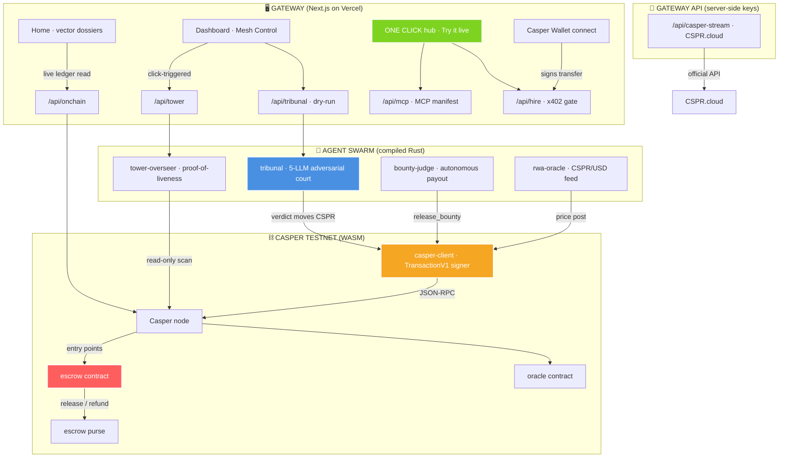

# 🌌 CASPER AGENTIC MESH — AST HYPERGRAPH & SYSTEM BLUEPRINT

> **Auto-generated index of the project's structure and symbol graph.**

## 🗺️ 1. Architecture hypergraph (Mermaid)

```mermaid
graph TD
    subgraph UI["🖥️ GATEWAY (Next.js on Vercel)"]
        Home["Home · vector dossiers"] -->|live ledger read| ApiOnchain
        Dash["Dashboard · Mesh Control"] -->|click-triggered| ApiTower
        Dash --> ApiTribunal
        Hub["ONE CLICK hub · Try it live"] --> ApiMcp
        Hub --> ApiHire
        Wallet["Casper Wallet connect"] -->|signs transfer| ApiHire
    end

    subgraph API["🔌 GATEWAY API (server-side keys)"]
        ApiOnchain["/api/onchain"]
        ApiHire["/api/hire · x402 gate"]
        ApiMcp["/api/mcp · MCP manifest"]
        ApiStream["/api/casper-stream · CSPR.cloud"]
        ApiTower["/api/tower"]
        ApiTribunal["/api/tribunal · dry-run"]
    end

    subgraph AGENTS["🐝 AGENT SWARM (compiled Rust)"]
        Tower["tower-overseer · proof-of-liveness"]
        Tribunal["tribunal · 5-LLM adversarial court"]
        Judge["bounty-judge · autonomous payout"]
        Oracle["rwa-oracle · CSPR/USD feed"]
    end

    subgraph CASPER["⛓️ CASPER TESTNET (WASM)"]
        Client["casper-client · TransactionV1 signer"] -->|JSON-RPC| Node["Casper node"]
        Node -->|entry points| Contract["escrow contract"]
        Node --> OracleContract["oracle contract"]
        Contract -->|release / refund| Escrow["escrow purse"]
    end

    %% cross-layer
    ApiTower --> Tower
    ApiTribunal --> Tribunal
    ApiOnchain --> Node
    ApiStream -->|official API| Cloud["CSPR.cloud"]
    Tribunal -->|verdict moves CSPR| Client
    Judge -->|release_bounty| Client
    Oracle -->|price post| Client
    Tower -->|read-only scan| Node

    style Contract fill:#ff5e5e,stroke:#fff,stroke-width:2px,color:#fff
    style Tribunal fill:#4a90e2,stroke:#fff,stroke-width:2px,color:#fff
    style Client fill:#f5a623,stroke:#fff,stroke-width:2px,color:#fff
    style Hub fill:#7ed321,stroke:#fff,stroke-width:2px,color:#fff
```

## 📝 2. Module & AST symbol registry

Indexed **8 modules** and **139 AST definitions**.

### 📂 Smart Contract

| Kind | Symbol | File |
| :--- | :--- | :--- |
| `function` | `build_entry_points` | `contracts/casper-mesh-contract/src/lib.rs` |
| `function` | `call` | `contracts/casper-mesh-contract/src/lib.rs` |
| `function` | `cl_type` | `contracts/casper-mesh-contract/src/lib.rs` |
| `function` | `cl_type` | `contracts/casper-mesh-contract/src/lib.rs` |
| `function` | `create_bounty` | `contracts/casper-mesh-contract/src/lib.rs` |
| `function` | `emit_mesh_event` | `contracts/casper-mesh-contract/src/lib.rs` |
| `function` | `from_bytes` | `contracts/casper-mesh-contract/src/lib.rs` |
| `function` | `from_bytes` | `contracts/casper-mesh-contract/src/lib.rs` |
| `function` | `get_dict_uref` | `contracts/casper-mesh-contract/src/lib.rs` |
| `function` | `get_escrow_purse` | `contracts/casper-mesh-contract/src/lib.rs` |
| `function` | `init` | `contracts/casper-mesh-contract/src/lib.rs` |
| `function` | `parse_account_hash` | `contracts/casper-mesh-contract/src/lib.rs` |
| `function` | `ping` | `contracts/casper-mesh-contract/src/lib.rs` |
| `function` | `refund_bounty` | `contracts/casper-mesh-contract/src/lib.rs` |
| `function` | `register_agent` | `contracts/casper-mesh-contract/src/lib.rs` |
| `function` | `release_bounty` | `contracts/casper-mesh-contract/src/lib.rs` |
| `function` | `serialized_length` | `contracts/casper-mesh-contract/src/lib.rs` |
| `function` | `serialized_length` | `contracts/casper-mesh-contract/src/lib.rs` |
| `function` | `to_bytes` | `contracts/casper-mesh-contract/src/lib.rs` |
| `function` | `to_bytes` | `contracts/casper-mesh-contract/src/lib.rs` |
| `impl` | `CLTyped` | `contracts/casper-mesh-contract/src/lib.rs` |
| `impl` | `CLTyped` | `contracts/casper-mesh-contract/src/lib.rs` |
| `impl` | `FromBytes` | `contracts/casper-mesh-contract/src/lib.rs` |
| `impl` | `FromBytes` | `contracts/casper-mesh-contract/src/lib.rs` |
| `impl` | `ToBytes` | `contracts/casper-mesh-contract/src/lib.rs` |
| `impl` | `ToBytes` | `contracts/casper-mesh-contract/src/lib.rs` |
| `struct` | `Agent` | `contracts/casper-mesh-contract/src/lib.rs` |
| `struct` | `Bounty` | `contracts/casper-mesh-contract/src/lib.rs` |

---

### 📂 Casper RPC Client

| Kind | Symbol | File |
| :--- | :--- | :--- |
| `enum` | `Commands` | `swarm/casper-client/src/main.rs` |
| `function` | `new` | `swarm/casper-client/src/main.rs` |
| `function` | `post_rpc` | `swarm/casper-client/src/main.rs` |
| `impl` | `RpcRequest` | `swarm/casper-client/src/main.rs` |
| `struct` | `Cli` | `swarm/casper-client/src/main.rs` |
| `struct` | `RpcRequest` | `swarm/casper-client/src/main.rs` |

---

### 📂 Crate: bounty-judge

| Kind | Symbol | File |
| :--- | :--- | :--- |
| `function` | `arg` | `swarm/bounty-judge/src/main.rs` |
| `function` | `classify_verdict` | `swarm/bounty-judge/src/main.rs` |
| `function` | `env_or` | `swarm/bounty-judge/src/main.rs` |
| `function` | `llm_judge` | `swarm/bounty-judge/src/main.rs` |
| `function` | `parse_u64_le_hex` | `swarm/bounty-judge/src/main.rs` |
| `function` | `release_on_chain` | `swarm/bounty-judge/src/main.rs` |
| `function` | `reputation_hex_parses_le_u64` | `swarm/bounty-judge/src/main.rs` |
| `function` | `risk_gate` | `swarm/bounty-judge/src/main.rs` |
| `function` | `verdict_classification` | `swarm/bounty-judge/src/main.rs` |
| `struct` | `Verdict` | `swarm/bounty-judge/src/main.rs` |

---

### 📂 Crate: rwa-oracle

| Kind | Symbol | File |
| :--- | :--- | :--- |
| `function` | `converts_usd_to_micro_usd` | `swarm/rwa-oracle/src/main.rs` |
| `function` | `env_or` | `swarm/rwa-oracle/src/main.rs` |
| `function` | `fetch_price_usd` | `swarm/rwa-oracle/src/main.rs` |
| `function` | `post_reading_on_chain` | `swarm/rwa-oracle/src/main.rs` |
| `function` | `to_micro_usd` | `swarm/rwa-oracle/src/main.rs` |

---

### 📂 Crate: tribunal

| Kind | Symbol | File |
| :--- | :--- | :--- |
| `function` | `anchor_verdict` | `swarm/tribunal/src/main.rs` |
| `function` | `arg` | `swarm/tribunal/src/main.rs` |
| `function` | `ask` | `swarm/tribunal/src/main.rs` |
| `function` | `classifies_verdict_forms` | `swarm/tribunal/src/main.rs` |
| `function` | `classify` | `swarm/tribunal/src/main.rs` |
| `function` | `env_or` | `swarm/tribunal/src/main.rs` |
| `function` | `escrow_call` | `swarm/tribunal/src/main.rs` |
| `function` | `jury_majority` | `swarm/tribunal/src/main.rs` |
| `function` | `signer_call` | `swarm/tribunal/src/main.rs` |

---

### 📂 Crate: tower

| Kind | Symbol | File |
| :--- | :--- | :--- |
| `function` | `call` | `swarm/tower/src/main.rs` |
| `function` | `decode_cl_string` | `swarm/tower/src/main.rs` |
| `function` | `decode_cl_u64` | `swarm/tower/src/main.rs` |
| `function` | `decodes_cl_string_and_u64` | `swarm/tower/src/main.rs` |
| `function` | `dict_string` | `swarm/tower/src/main.rs` |
| `function` | `dict_u64` | `swarm/tower/src/main.rs` |
| `function` | `env_or` | `swarm/tower/src/main.rs` |
| `function` | `new` | `swarm/tower/src/main.rs` |
| `function` | `now_secs` | `swarm/tower/src/main.rs` |
| `function` | `parses_reading_value` | `swarm/tower/src/main.rs` |
| `function` | `reading_value` | `swarm/tower/src/main.rs` |
| `function` | `scan` | `swarm/tower/src/main.rs` |
| `function` | `state_root` | `swarm/tower/src/main.rs` |
| `impl` | `Rpc` | `swarm/tower/src/main.rs` |
| `struct` | `Rpc` | `swarm/tower/src/main.rs` |

---

### 📂 Frontend UI (Next.js)

| Kind | Symbol | File |
| :--- | :--- | :--- |
| `function` | `AgentOrb` | `gateway/src/components/AgentOrb.tsx` |
| `function` | `AgentRegistry` | `gateway/src/lib/agent_registry.ts` |
| `function` | `AppProvider` | `gateway/src/context/AppContext.tsx` |
| `function` | `CarbonFabric` | `gateway/src/components/CarbonFabric.tsx` |
| `function` | `CinematicDim` | `gateway/src/components/CinematicDim.tsx` |
| `function` | `CornerMarks` | `gateway/src/components/AgentNetworkGrid.tsx` |
| `function` | `CrystalForge` | `gateway/src/components/CrystalForge.tsx` |
| `function` | `CursorAura` | `gateway/src/components/CursorAura.tsx` |
| `function` | `EcosystemStrips` | `gateway/src/components/EcosystemStrips.tsx` |
| `function` | `Footer` | `gateway/src/components/Footer.tsx` |
| `function` | `GlitchWormProgress` | `gateway/src/components/GlitchWormProgress.tsx` |
| `function` | `HeroCard` | `gateway/src/components/HeroCard.tsx` |
| `function` | `HeroScene` | `gateway/src/components/HeroCard.tsx` |
| `function` | `HoverReel` | `gateway/src/components/HoverReel.tsx` |
| `function` | `ManifestoReveal` | `gateway/src/components/ManifestoReveal.tsx` |
| `function` | `MeshControl` | `gateway/src/components/MeshControl.tsx` |
| `function` | `MeshFooter` | `gateway/src/components/MeshFooter.tsx` |
| `function` | `Nav` | `gateway/src/components/Nav.tsx` |
| `function` | `OneClickHub` | `gateway/src/components/OneClickHub.tsx` |
| `function` | `PixelDecodeText` | `gateway/src/components/PixelDecodeText.tsx` |
| `function` | `ScrambleCta` | `gateway/src/components/OneClickHub.tsx` |
| `function` | `ScrollHero` | `gateway/src/components/ScrollHero.tsx` |
| `function` | `SmoothScroller` | `gateway/src/components/SmoothScroller.tsx` |
| `function` | `VECTORS` | `gateway/src/components/VectorDossier.tsx` |
| `function` | `VectorDossier` | `gateway/src/components/VectorDossier.tsx` |
| `function` | `alt` | `gateway/src/app/opengraph-image.tsx` |
| `function` | `contentType` | `gateway/src/app/opengraph-image.tsx` |
| `function` | `dynamic` | `gateway/src/app/api/agents/route.ts` |
| `function` | `dynamic` | `gateway/src/app/api/tower/route.ts` |
| `function` | `dynamic` | `gateway/src/app/api/tribunal/route.ts` |
| `function` | `dynamic` | `gateway/src/app/api/demo-tx/route.ts` |
| `function` | `dynamic` | `gateway/src/app/api/tower/stream/route.ts` |
| `function` | `getCasperProvider` | `gateway/src/lib/casper-wallet.ts` |
| `function` | `isAllowedUrl` | `gateway/src/lib/security.ts` |
| `function` | `isCasperWalletInstalled` | `gateway/src/lib/casper-wallet.ts` |
| `function` | `maxDuration` | `gateway/src/app/api/tower/route.ts` |
| `function` | `maxDuration` | `gateway/src/app/api/tribunal/route.ts` |
| `function` | `maxDuration` | `gateway/src/app/api/demo-tx/route.ts` |
| `function` | `maxDuration` | `gateway/src/app/api/tower/stream/route.ts` |
| `function` | `metadata` | `gateway/src/app/layout.tsx` |
| `function` | `metadata` | `gateway/src/app/(app)/dashboard/page.tsx` |
| `function` | `metadata` | `gateway/src/app/(app)/bounties/page.tsx` |
| `function` | `replayGuard` | `gateway/src/lib/replay-guard.ts` |
| `function` | `revalidate` | `gateway/src/app/api/telemetry/route.ts` |
| `function` | `revalidate` | `gateway/src/app/api/onchain/route.ts` |
| `function` | `revalidate` | `gateway/src/app/api/casper-stream/route.ts` |
| `function` | `runAgent` | `gateway/src/lib/agents.ts` |
| `function` | `runtime` | `gateway/src/app/opengraph-image.tsx` |
| `function` | `runtime` | `gateway/src/app/api/tower/stream/route.ts` |
| `function` | `size` | `gateway/src/app/opengraph-image.tsx` |
| `function` | `spendingPolicy` | `gateway/src/lib/spending-policy.ts` |
| `function` | `useApp` | `gateway/src/context/AppContext.tsx` |
| `interface` | `AgentRecord` | `gateway/src/lib/agent_registry.ts` |
| `interface` | `AgentRun` | `gateway/src/lib/agents.ts` |
| `interface` | `CasperProvider` | `gateway/src/lib/casper-wallet.ts` |
| `interface` | `DegradationConfig` | `gateway/src/lib/security.ts` |
| `interface` | `DegradationResult` | `gateway/src/lib/security.ts` |
| `interface` | `OnChainSnapshot` | `gateway/src/lib/onchain.ts` |
| `interface` | `PaymentValidationResult` | `gateway/src/lib/casper.ts` |
| `interface` | `SandboxResult` | `gateway/src/lib/wasm_sandbox.ts` |
| `interface` | `SpendingPolicyConfig` | `gateway/src/lib/spending-policy.ts` |
| `interface` | `TransactorContext` | `gateway/src/lib/casper-transactor.ts` |
| `type` | `AgentState` | `gateway/src/components/AgentOrb.tsx` |
| `type` | `DegradationStrategy` | `gateway/src/lib/security.ts` |
| `type` | `DossierOpen` | `gateway/src/components/VectorDossier.tsx` |

---

### 📂 Tauri Host Backend

| Kind | Symbol | File |
| :--- | :--- | :--- |
| `function` | `run` | `gateway/src-tauri/src/lib.rs` |

---

